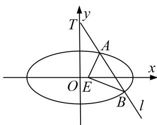

<!-- question-source:start -->
3. 已知椭圆 $C: \frac{y^2}{a^2} + \frac{x^2}{b^2} = 1 (a > b > 0)$ 的离心率为 $\frac{\sqrt{6}}{3}$ , 且椭圆 $C$ 上的点到一个焦点的距离的最小值为 $\sqrt{3} - \sqrt{2}$ .

(1)求椭圆 C 的方程;

(2)已知过点 $T(0, 2)$ 的直线 $l$ 与椭圆 $C$ 交于 $A, B$ 两点，若在 $x$ 轴上存在一点 $E$ ，使 $\angle AEB = 90^{\circ}$ ，求直线 $l$ 的斜率 $k$ 的取值范围.

<!-- question-source:end -->

![[高中/总复习/专题/圆锥曲线/专题22  斜率型取值范围模型-圆锥曲线/专题22_斜率型取值范围模型/对点训练/题目/answers/Q00032607A1.md]]
