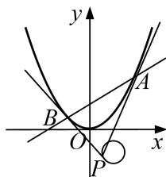

<!-- question-source:start -->
7. 在直角坐标系 $xOy$ 中，曲线 $C_1$ 上的任意一点 $M$ 到直线 $y = -1$ 的距离比 $M$ 点到点 $F(0, 2)$ 的距离小 1.

(1)求动点 M 的轨迹 $C_{1}$ 的方程;

(2)若点 P 是圆 $C_{2}:(x-2)^{2}+(y+2)^{2}=1$ 上一动点，过点 P 作曲线 $C_{1}$ 的两条切线，切点分别为 A, B，求直线 AB 斜率的取值范围.

<!-- question-source:end -->

![[高中/总复习/专题/圆锥曲线/专题22  斜率型取值范围模型-圆锥曲线/专题22_斜率型取值范围模型/对点训练/题目/answers/Q00032611A1.md]]
