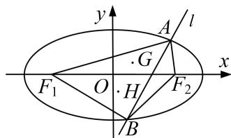

<!-- question-source:start -->
[例 2] 已知 m>1，直线 $l: x-my-\frac{m^{2}}{2}=0$ ，椭圆 $C: \frac{x^{2}}{m^{2}}+y^{2}=1$ ， $F_{1}$ ， $F_{2}$ 分别为椭圆 C 的左、右焦点.

(1)当直线 l 过右焦点 $F_{2}$ 时，求直线 l 的方程；

(2)设直线 $l$ 与椭圆 $C$ 交于 $A, B$ 两点， $\triangle AF_1F_2, \triangle BF_1F_2$ 的重心分别为 $G, H$ ，若原点 $O$ 在以线段 $GH$ 为直径的圆内，求实数 $m$ 的取值范围.

[规范解答]
(1) 因为直线 $l: x - my - \frac{m^2}{2} = 0$ 经过 $F_2(\sqrt{m^2 - 1}, 0)$ ，所以 $\sqrt{m^2 - 1} = \frac{m^2}{2}$ ，得 $m^2 = 2$ . 又因为 $m > 1$ ，所以 $m = \sqrt{2}$ ，故直线 $l$ 的方程为 $x - \sqrt{2}y - 1 = 0$ .

(2)设 $A(x_{1},y_{1})$ ， $B(x_{2},y_{2})$ ，由 $\left\{ \begin{array}{l}x = my + \frac{m^2}{2},\\ \frac{x^2}{m^2} +y^2 = 1, \end{array} \right.$ 消去 $x$ ，得 $2y^{2} + my + \frac{m^{2}}{4} -1 = 0,$

则由 $\Delta=m^{2}-8\left(\frac{m^{2}}{4}-1\right)=-m^{2}+8>0$ ，知 $m^{2}<8$ ，且有 $y_{1}+y_{2}=-\frac{m}{2}$ ， $y_{1}\cdot y_{2}=\frac{m^{2}}{8}-\frac{1}{2}$ .

由于 $F_{1}(-c, 0)$ ， $F_{2}(c, 0)$ ，可知 $G\left(\frac{x_{1}}{3}, \frac{y_{1}}{3}\right)$ ， $H\left(\frac{x_{2}}{3}, \frac{y_{2}}{3}\right)$ .

因为原点 O 在以线段 GH 为直径的圆内，所以 $\overrightarrow{OH} \cdot \overrightarrow{OG} < 0$ ，即 $x_{1}x_{2} + y_{1}y_{2} < 0$ .

所以 $x_{1}x_{2}+y_{1}y_{2}=\left(my_{1}+\frac{m^{2}}{2}\right)\left(my_{2}+\frac{m^{2}}{2}\right)+y_{1}y_{2}=(m^{2}+1)\cdot\left(\frac{m^{2}}{8}-\frac{1}{2}\right)<0.$
<!-- question-source:end -->

![[高中/总复习/专题/圆锥曲线/专题23  参数及点的坐标(横或纵)型取值范围模型-圆锥曲线/专题23__参数及点的坐标_横或纵_型取值范围模型/例题/answers/Q00042569A1.md]]
