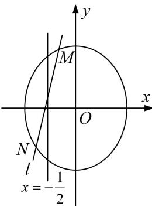

<!-- question-source:start -->
[例4] 已知中心在原点，焦点在 $y$ 轴上的椭圆 $C$ ，其上一点 $\mathbf{Q}$ 到两个焦点 $F_{1}, F_{2}$ 的距离之和为4，离心率为 $\frac{\sqrt{3}}{2}$ .

(1)求椭圆 C 的方程;

(2)若直线 $l$ 与椭圆 $C$ 交于不同的两点 $M, N$ , 且线段 $MN$ 恰被直线 $x = -\frac{1}{2}$ 平分, 设弦 $MN$ 的垂直平分线的方程为 $y = kx + m$ , 求 $m$ 的取值范围.

[破题思路]
<!-- question-source:end -->

![[高中/总复习/专题/圆锥曲线/专题23  参数及点的坐标(横或纵)型取值范围模型-圆锥曲线/专题23__参数及点的坐标_横或纵_型取值范围模型/例题/answers/Q00042571A1.md]]
