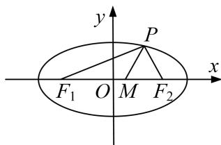

<!-- question-source:start -->
[例7] 椭圆 $C: \frac{x^2}{a^2} + \frac{y^2}{b^2} = 1 (a > b > 0)$ 的左、右焦点分别是 $F_1, F_2$ ，离心率为 $\frac{\sqrt{3}}{2}$ ，过点 $F_1$ 且垂直于 $x$ 轴的直线被椭圆 $C$ 截得的线段长为 1.

(1)求椭圆 C 的方程;

(2)点 $P$ 是椭圆 $C$ 上除长轴端点外的任一点，连接 $PF_{1}$ ， $PF_{2}$ ，设 $\angle F_{1}PF_{2}$ 的角平分线 $PM$ 交 $C$ 的长轴于点 $M(m,0)$ ，求 $m$ 的取值范围.

[规范解答]
(1) 将 $x = -c$ 代入椭圆的方程 $\frac{x^2}{a^2} + \frac{y^2}{b^2} = 1$ ，得 $y = \pm \frac{b^2}{a}$ .

由题意知 $\frac{2b^{2}}{a}=1$ ，故 $a=2b^{2}$ 。又 $e=\frac{c}{a}=\frac{\sqrt{3}}{2}$ ，则 $\frac{b}{a}=\frac{1}{2}$ ，即a=2b，所以a=2，b=1，

故椭圆 C 的方程为 $\frac{x^{2}}{4} + y^{2} = 1$ .

(2)由 $PM$ 是 $\angle F_{1}PF_{2}$ 的角平分线，可得 $\frac{|PF_1|}{|F_1M|} = \frac{|PF_2|}{|F_2M|}$ ，即 $\frac{|PF_1|}{|PF_2|} = \frac{|F_1M|}{|F_2M|}$ .

设点 $P(x_0, y_0)(-2 < x_0 < 2)$ ，又点 $F_1(-\sqrt{3}, 0), F_2(\sqrt{3}, 0), M(m, 0)$

$$
\left| P F _ {1} \right| = \sqrt {\left(- \sqrt {3} - x _ {0}\right) ^ {2} + y _ {0} ^ {2}} = 2 + \frac {\sqrt {3}}{2} x _ {0}, \left| P F _ {2} \right| = \sqrt {\left(\sqrt {3} - x _ {0}\right) ^ {2} + y _ {0} ^ {2}} = 2 - \frac {\sqrt {3}}{2} x _ {0}.
$$

又 $|F_{1}M|=|m+\sqrt{3}|$ ， $|F_{2}M|=|m-\sqrt{3}|$ ，且 $-\sqrt{3}<m<\sqrt{3}$ ，所以 $|F_{1}M|=m+\sqrt{3}$ ， $|F_{2}M|=\sqrt{3}-m$ .

所以 $\frac{2+\frac{\sqrt{3}}{2}x_{0}}{2-\frac{\sqrt{3}}{2}x_{0}}=\frac{\sqrt{3}+m}{\sqrt{3}-m}$ ，化简得 $m=\frac{3}{4}x_{0}$ ，而 $-2<x_{0}<2$ ，因此 $-\frac{3}{2}<m<\frac{3}{2}$ .

故实数 m 的取值范围为 $\left(-\frac{3}{2}, \frac{3}{2}\right)$ .
<!-- question-source:end -->
