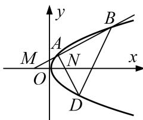

<!-- question-source:start -->
[例 8] 已知直线 x = -2 上有一动点 Q，过点 Q 作直线 $l_{1}$ 垂直于 y 轴，动点 P 在 $l_{1}$ 上，且满足 $\overrightarrow{OP} \cdot \overrightarrow{OQ} = 0$ (O 为坐标原点)，记点 P 的轨迹为曲线 C.

(1)求曲线 C 的方程;

(2)已知定点 $M\left(-\frac{1}{2},0\right),N\left(\frac{1}{2},0\right)$ ， $A$ 为曲线 $C$ 上一点，直线 $AM$ 交曲线 $C$ 于另一点 $B$ ，且点 $A$ 在线段 $MB$ 上，直线 $AN$ 交曲线 $C$ 于另一点 $D$ ，求 $\triangle MBD$ 的内切圆半径 $r$ 的取值范围.

[规范解答]
(1)设点 $P(x, y)$ ，则 $Q(-2, y)$ ，∴ $=(x, y)$ ， $=( -2, y)$ .

$\because\overrightarrow{OP}\cdot\overrightarrow{OQ}=0=0,\quad\therefore=-2x+y^{2}=0,$ 即 $y^{2}=2x.\quad\therefore$ 曲线 C 的方程为 $y^{2}=2x.$

(2)设 $A(x_{1},y_{1})$ ， $B(x_{2},y_{2})$ ， $D(x_{3},y_{3})$ ，直线 $BD$ 与 $\pmb{x}$ 轴的交点为 $E$ ，直线 $AB$ 与 $\triangle MBD$ 内切圆的切点为 $T$

设直线 AM 的方程为 $y=k\left(x+\frac{1}{2}\right)$ ，则联立方程组 $\left\{\begin{aligned}y=k\left(x+\frac{1}{2}\right),\\ y^{2}=2x,\end{aligned}\right.$ 得 $k^{2}x^{2}+(k^{2}-2)x+\frac{k^{2}}{4}=0,$

$$
\therefore x _ {1} x _ {2} = \frac {1}{4} \text {且} 0 <   x _ {1} <   x _ {2}, \quad \therefore x _ {1} <   \frac {1}{2} <   x _ {2}.
$$

∵ 直线 AN 的方程为 $y=\frac{y_{1}}{x_{1}-\frac{1}{2}}\left(x-\frac{1}{2}\right)$ ，与方程 $y^{2}=2x$ 联立得 $y_{1}^{2}x^{2}-\left(y_{1}^{2}+2x_{1}^{2}-2x_{1}+\frac{1}{2}\right)x+\frac{1}{4}y_{1}^{2}=0$ ，

化简得 $2x_{1}x^{2}-\left(2x_{1}^{2}+\frac{1}{2}\right)x+\frac{1}{2}x_{1}=0$ ，解得 $x_{3}=\frac{1}{4x_{1}}$ 或 $x_{3}=x_{1}$ (舍去). $\because x_{3}=\frac{1}{4x_{1}}=x_{2}, \therefore BD \perp x$ 轴，设 $\triangle MBD$ 的内切圆圆心为 $H$ ，则点 $H$ 在 $x$ 轴上且 $HT \perp AB$ .

$\therefore S_{\triangle MBD} = \frac{1}{2}\left(x_2 + \frac{1}{2}\right)|2y_2|$ ，且 $\triangle MBD$ 的周长为 $2\sqrt{\left(x_2 + \frac{1}{2}\right)^2 + y_2^2} + 2|y_2|$ ，

$$
\therefore S _ {\triangle M B D} = \frac {1}{2} \left[ 2 \sqrt {\left(x _ {2} + \frac {1}{2}\right) ^ {2} + y _ {2} ^ {2}} + 2 | y _ {2} | \right] \cdot r = \frac {1}{2} \left(x _ {2} + \frac {1}{2}\right) | 2 y _ {2} |,
$$

$$
\therefore r = \frac {\left(x _ {2} + \frac {1}{2}\right) _ {| y _ {2} |}}{| y _ {2} | + \sqrt {\left(x _ {2} + \frac {1}{2}\right) ^ {2} + y _ {2} ^ {2}}} = \frac {1}{\frac {1}{x _ {2} + \frac {1}{2}} + \sqrt {\frac {1}{y _ {2} ^ {2}} + \frac {1}{\left(x _ {2} + \frac {1}{2}\right) ^ {2}}}} = \frac {1}{\sqrt {\frac {1}{2 x _ {2}} + \frac {1}{\left(x _ {2} + \frac {1}{2}\right) ^ {2}} + \frac {1}{x _ {2} + \frac {1}{2}}}},
$$

令 $t=x_{2}+\frac{1}{2}$ ，则 t>1，

$\therefore r = \frac{1}{\sqrt{\frac{1}{2t - 1} + \frac{1}{t^2} + \frac{1}{t}}}$ 在区间 $(1, +\infty)$ 上单调递增，则 $r > \frac{1}{\sqrt{2} + 1} = \sqrt{2} - 1$

即 r 的取值范围为 $(\sqrt{2}-1, +\infty)$ .

## 【对点训练】
<!-- question-source:end -->
