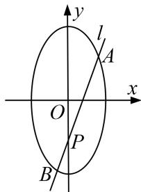

<!-- question-source:start -->
2. 已知焦点在 $y$ 轴上的椭圆 $E$ 的中心是原点 $O$ , 离心率等于 $\frac{\sqrt{3}}{2}$ , 以椭圆 $E$ 的长轴和短轴为对角线的四边形的周长为 $4\sqrt{5}$ . 直线 $l: y = kx + m$ 与 $y$ 轴交于点 $P$ , 与椭圆 $E$ 相交于 $A, B$ 两个点.

(1)求椭圆 E 的方程;

(2)若 $\overrightarrow{AP} = 3\overrightarrow{PB}$ ，求 $m^2$ 的取值范围.

<!-- question-source:end -->

![[高中/总复习/专题/圆锥曲线/专题23  参数及点的坐标(横或纵)型取值范围模型-圆锥曲线/专题23__参数及点的坐标_横或纵_型取值范围模型/对点训练/answers/Q00042577A1.md]]
