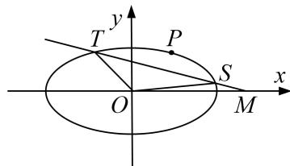

<!-- question-source:start -->
3. 已知椭圆 $C: \frac{x^2}{a^2} + \frac{y^2}{b^2} = 1 (a > b > 0)$ 的两焦点与短轴的一个端点的连线构成等腰直角三角形，直线 $x + y + 1 = 0$ 与以椭圆 $C$ 的右焦点为圆心，以椭圆的长半轴长为半径的圆相切.

(1)求椭圆 C 的方程;

(2)过点 $M(2,0)$ 的直线 l 与椭圆 C 相交于不同的两点 S 和 T，若椭圆 C 上存在点 P 满足 $\overrightarrow{OS} + \overrightarrow{OT} = t\overrightarrow{OP}$ (其中 O 为坐标原点)，求实数 t 的取值范围.

<!-- question-source:end -->

![[高中/总复习/专题/圆锥曲线/专题23  参数及点的坐标(横或纵)型取值范围模型-圆锥曲线/专题23__参数及点的坐标_横或纵_型取值范围模型/对点训练/answers/Q00042578A1.md]]
