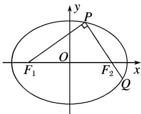

<!-- question-source:start -->
8. 如图，椭圆 $\frac{x^2}{a^2} + \frac{y^2}{b^2} = 1 (a > b > 0)$ 的左、右焦点分别为 $F_1, F_2$ ，过 $F_2$ 的直线交椭圆于 $P, Q$ 两点，且 $PQ \perp PF_1$ .

(1)若 $|PF_{1}|=2+\sqrt{2}$ ， $|PF_{2}|=2-\sqrt{2}$ ，求椭圆的标准方程；

(2)若 $|PQ|=\lambda|PF_{1}|$ ，且 $\frac{3}{4}\leq\lambda<\frac{4}{3}$ ，试确定椭圆离心率e的取值范围.

<!-- question-source:end -->

![[高中/总复习/专题/圆锥曲线/专题23  参数及点的坐标(横或纵)型取值范围模型-圆锥曲线/专题23__参数及点的坐标_横或纵_型取值范围模型/对点训练/answers/Q00042582A1.md]]
