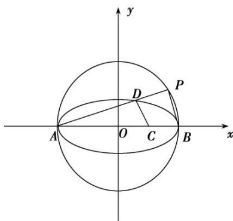

> [!faq]- 《专题23  参数及点的坐标(横或纵)型取值范围模型-圆锥曲线》例题解析
>
> > [!success]- **【答案】** 详见解析
>
> > [!note]- **【分析】**
> > 本题未单列分析。
>
> > [!note]- **【解析】**
> > (1)若 $\angle ADC=90^{\circ}$ ，求 $\triangle ADC$ 的面积 $S$ ;
> > (2)设直线 PB, DC 的斜率存在且分别为 $k_{1}$ , $k_{2}$ ，若 $k_{1}=\lambda k_{2}$ ，求 $\lambda$ 的取值范围.
> > 
> > 4. 解析
> > (1)依题意， $A(-2,0)$ . 设 $D(x_{1},y_{1})$ ，则 $\frac{x_{1}^{2}}{4} + y_{1}^{2} = 1$ . 由 $\angle ADC = 90^{\circ}$ 得 $k_{AD} \cdot k_{CD} = -1$ ,
> > $\therefore \frac{y_1}{x_1 + 2} \cdot \frac{y_1}{x_1 - 1} = -1, \therefore \frac{y_1^2}{(x_1 + 2) \cdot (x_1 - 1)} = \frac{1 - \frac{x_1^2}{4}}{x_1^2 + x_1 - 2} = -1,$ 解得 $x_1 = \frac{2}{3}, x_1 = -2$ （舍去）， $\therefore |y_1| = \frac{2\sqrt{2}}{3}, S = \frac{1}{2} \times \frac{2\sqrt{2}}{3} \times 3 = \sqrt{2}.$
> > (2)设 $D(x_{2}, y_{2})$ ，∵动点 P 在圆 $x^{2}+y^{2}=4$ 上，∴ $k_{PB} \cdot k_{PA} = -1$ .
> > 又 $k_{1}=\lambda k_{2},\quad\therefore\frac{-1}{\frac{y_{2}}{x_{2}+2}}=\lambda\cdot\frac{y_{2}}{x_{2}-1},$
> > $$
> > \lambda = - \frac {(x _ {2} + 2) (x _ {2} - 1)}{y _ {2} ^ {2}} = - \frac {(x _ {2} + 2) (x _ {2} - 1)}{1 - \frac {x _ {2} ^ {2}}{4}} = - \frac {(x _ {2} + 2) (x _ {2} - 1)}{\frac {1}{4} (4 - x _ {2} ^ {2})} = 4 \cdot \frac {x _ {2} - 1}{x _ {2} - 2} = 4 \left(1 + \frac {1}{x _ {2} - 2}\right).
> > $$
> > 又由题意可知 $x_{2}\in(-2,2)$ ，且 $x_{2}\neq1$ ，
> > 则问题可转化为求函数 $f(x) = 4\left(1 + \frac{1}{x - 2}\right)(x \in (-2, 2)$ ，且 $x \neq 1)$ 的值域.
> > 由导数可知函数 $f(x)$ 在其定义域内为减函数，∴ 函数 $f(x)$ 的值域为 $(-∞, 0) ∪ (0, 3)$ ,
> > 从而 $\lambda$ 的取值范围为 $(-∞, 0)∪(0, 3)$ .
