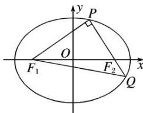

> [!faq]- 《专题23  参数及点的坐标(横或纵)型取值范围模型-圆锥曲线》例题解析
>
> > [!success]- **【答案】** 详见解析
>
> > [!note]- **【分析】**
> > 本题未单列分析。
>
> > [!note]- **【解析】**
> > (1)若 $|PF_{1}|=2+\sqrt{2}$ ， $|PF_{2}|=2-\sqrt{2}$ ，求椭圆的标准方程；
> > (2)若 $|PQ|=\lambda|PF_{1}|$ ，且 $\frac{3}{4}\leq\lambda<\frac{4}{3}$ ，试确定椭圆离心率e的取值范围.
> > 
> > 8. 解析
> > (1)由椭圆的定义知， $2a=|PF_{1}|+|PF_{2}|=(2+\sqrt{2})+(2-\sqrt{2})=4$ ，故 a=2.
> > 设椭圆的半焦距为 c，由已知得 $PF_{1} \perp PF_{2}$ ，因此 $2c=|F_{1}F_{2}|=\sqrt{|PF_{1}|^{2}+|PF_{2}|^{2}}=\sqrt{(2+\sqrt{2})^{2}+(2-\sqrt{2})^{2}}=2\sqrt{3}$ ，即 $c=\sqrt{3}$ ，从而 $b=\sqrt{a^{2}-c^{2}}=1$ .
> > 故所求椭圆的标准方程为 $\frac{x^{2}}{4}+y^{2}=1$ .
> > (2)如图，由 $PF_{1} \perp PQ$ ， $|PQ| = \lambda |PF_{1}|$ ，得 $|QF_{1}| = \sqrt{|PF_{1}|^{2} + |PQ|^{2}} = \sqrt{1 + \lambda^{2}} |PF_{1}|$ .
> > 
> > 由椭圆的定义知， $|PF_{1}|+|PF_{2}|=2a,\quad|QF_{1}|+|QF_{2}|=2a,$
> > 所以 $|PF_{1}|+|PQ|+|QF_{1}|=4a$ 。于是 $(1+\lambda+\sqrt{1+\lambda^{2}})|PF_{1}|=4a$ ，解得 $|PF_{1}|=\frac{4a}{1+\lambda+\sqrt{1+\lambda^{2}}}$
> > $$
> > \left| P F _ {2} \right| = 2 a - \left| P F _ {1} \right| = \frac {2 a \left(\lambda + \sqrt {1 + \lambda^ {2}} - 1\right)}{1 + \lambda + \sqrt {1 + \lambda^ {2}}}
> > $$
> > 由勾股定理得 $|PF_{1}|^{2}+|PF_{2}|^{2}=|F_{1}F_{2}|^{2}=(2c)^{2}=4c^{2}$
> > 从而 $\left[\frac{4a}{1 + \lambda + \sqrt{1 + \lambda^2}}\right]^2 + \left[\frac{2a(\lambda + \sqrt{1 + \lambda^2} - 1)}{1 + \lambda + \sqrt{1 + \lambda^2}}\right]^2 = 4c^2$ ，两边除以 $4a^2$ ，得
> > $\frac{4}{(1 + \lambda + \sqrt{1 + \lambda^2})^2} + \frac{(\lambda + \sqrt{1 + \lambda^2} - 1)^2}{(1 + \lambda + \sqrt{1 + \lambda^2})^2} = e^2.$ 若记 $t = 1 + \lambda + \sqrt{1 + \lambda^2}$ ,
> > 则上式变成 $\mathrm{e}^2 = \frac{4 + (t - 2)^2}{t^2} = 8\left(\frac{1}{t} -\frac{1}{4}\right)^2 +\frac{1}{2}$ 由 $\frac{3}{4}\leq \lambda < \frac{4}{3}$ 及 $1 + \lambda +\sqrt{1 + \lambda^2}$ 关于 $\lambda$ 的单调性，得 $3\leq t <   4$ ，即 $\frac{1}{4} <  \frac{1}{t} \leq \frac{1}{3}$ ，进而 $\frac{1}{2} <  \mathrm{e}^{2}\leq \frac{5}{9}$ ，即 $\frac{\sqrt{2}}{2} <  \mathrm{e}\leq \frac{\sqrt{5}}{3}$
