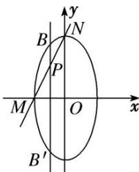

> [!faq]- 《专题23  参数及点的坐标(横或纵)型取值范围模型(教师版)》例题解析
>
> > [!success]- **【答案】** 详见解析
>
> > [!note]- **【解析】**
> > (2)给出线段 $MN$ 恰被直线 $x = -\frac{1}{2}$ 平分，弦 $MN$ 的垂直平分线方程为 $y = kx + m$ ，用 $y = kx + m$ 是弦 $MN$ 的中垂线及 $MN$ 的中点在直线 $x = -\frac{1}{2}$ 上，可设出中点坐标 $P\left(-\frac{1}{2}, y_0\right)$ ，建立 $y_0$ 与 $m$ 的关系，通过 $y_0$ 范围求 $m$ 范围或建立 $m$ 与 $k$ 的关系式．注意到 $MN$ 的中点在椭圆内部及直线 $x = -\frac{1}{2}$ 上，其隐含条件为线段 $MN$ 的中点纵坐标的范围可确定或联立直线 $l$ 与椭圆方程，利用判别式 $\Delta > 0$ 求解.
> >
> > [规范解答]
> > (1)由题意可设椭圆 C 的方程为 $\frac{y^{2}}{a^{2}} + \frac{x^{2}}{b^{2}} = 1 (a > b > 0)$ ，由条件可得 a = 2， $c = \sqrt{3}$ ，则 b = 1。
> > 故椭圆 C 的方程为 $\frac{y^{2}}{4} + x^{2} = 1$ .
> >
> > (2)法一：设弦 $MN$ 的中点为 $P\left(-\frac{1}{2}, y_0\right)$ ， $M(x_M, y_M)$ ， $N(x_N, y_N)$ ，则由点 $M$ ， $N$ 为椭圆 $C$ 上的点，可知 $4x_M^2 + y_M^2 = 4$ ， $4x_N^2 + y_N^2 = 4$ ，两式相减，得 $4(x_M - x_N)(x_M + x_N) + (y_M - y_N)(y_M + y_N) = 0$ ，
> >
> > 将 $x_{M} + x_{N} = 2 \times \left(-\frac{1}{2}\right) = -1, y_{M} + y_{N} = 2y_{0}, \frac{y_{M} - y_{N}}{x_{M} - x_{N}} = -\frac{1}{k}$ , 代入上式得 $k = -\frac{y_0}{2}$ .
> >
> > 又点 $P\left(-\frac{1}{2}, y_0\right)$ 在弦 $MN$ 的垂直平分线上，所以 $y_0 = -\frac{1}{2} k + m$ ，所以 $m = y_0 + \frac{1}{2} k = \frac{3}{4} y_0.$
> >
> > 
> >
> > 由点 $P\left(-\frac{1}{2}, y_0\right)$ 在线段 $BB'$ 上 $B'(x_B', y_B')$ ， $B(x_B, y_B)$ 为直线 $x = -\frac{1}{2}$ 与椭圆的交点，如图所示，所以 $y_B' < y_0 < y_B$ ，即 $-\sqrt{3} < y_0 < \sqrt{3}$ 。所以 $-\frac{3\sqrt{3}}{4} < m < \frac{3\sqrt{3}}{4}$ ，且 $m \neq 0$ 。
> >
> > 故 $m$ 的取值范围为 $\left(-\frac{3\sqrt{3}}{4}, 0\right) \cup \left(0, \frac{3\sqrt{3}}{4}\right)$ 。
> >
> > 法二：设弦 $MN$ 的中点为 $P\left(-\frac{1}{2}, y_0\right)$ ， $M(x_M, y_M)$ ， $N(x_N, y_N)$ ，则由点 $M$ ， $N$ 为椭圆 $C$ 上的点，可知 $4x_M^2 + y_M^2 = 4$ ， $4x_N^2 + y_N^2 = 4$ ，两式相减，得 $4(x_M - x_N)(x_M + x_N) + (y_M - y_N)(y_M + y_N) = 0$ ，
> >
> > 将 $x_M + x_N = 2 \times \left(-\frac{1}{2}\right) = -1$ ， $y_M + y_N = 2y_0$ ， $\frac{y_M - y_N}{x_M - x_N} = -\frac{1}{k}$ ，代入上式得 $y_0 = -2k$ 。
> >
> > 又点 $P\left(-\frac{1}{2}, y_0\right)$ 在弦 $MN$ 的垂直平分线上，所以 $y_0 = -\frac{1}{2} k + m$ ，所以 $m = y_0 + \frac{1}{2} k = -\frac{3}{2} k$ 。
> >
> > 设直线 $l$ 的方程为 $y + 2k = -\frac{1}{k}\left(x + \frac{1}{2}\right)$ ，即 $x = -ky - 2k^2 - \frac{1}{2}$ 联立 $\begin{cases} 4x^2 + y^2 = 4, \\ x = -ky - 2k^2 - \frac{1}{2}, \end{cases}$ 消去 $x$ ，得 $(4k^2 + 1)y^2 + 8k2k^2 + \frac{1}{2}y + 16k^4 + 8k^2 - 3 = 0$ ，
> >
> > 由 $\Delta > 0$ ，得 $k \in \left(-\frac{\sqrt{3}}{2}, 0\right) \cup \left(0, \frac{\sqrt{3}}{2}\right)$ ，所以 $m = -\frac{3}{2} k \in \left(-\frac{3\sqrt{3}}{4}, 0\right) \cup \left(0, \frac{3\sqrt{3}}{4}\right)$ ，即 $m$ 的取值范围为 $\left(-\frac{3\sqrt{3}}{4}, 0\right) \cup \left(0, \frac{3\sqrt{3}}{4}\right)$ 。
> >
> > [题后悟通] 利用点差法求解第
> > (2)问时，关键是利用点差法得到目标参数 $m$ 与 $y_0$ 的关系，再根据点 $P\left(-\frac{1}{2}, y_0\right)$ 与椭圆的位置关系得到 $y_0$ 的取值范围，从而求得目标参数 $m$ 的取值范围。很多同学在解决本题时往往出现如下失误：忽视 $y_0$ 的取值范围而造成思路受阻无法正确求解；利用判别式法求解此题时，抓住直线与圆锥曲线相交这一条件，利用判别式 $\Delta > 0$ 构建 $m$ 与 $k$ 的关系式，从而得所求，但部分考生忽视 $\Delta > 0$ 导致思路受阻而无法求解。
> >
> > 利用点在曲线内(外)的充要条件构建目标不等式的核心是抓住目标参数和某点的关系，根据点与圆锥曲线的位置关系构建目标不等式.
> >
> > 利用判别式构建目标不等式的核心是抓住直线与圆锥曲线的位置关系和判别式 $\Delta$ 的关系建立目标不等式.
