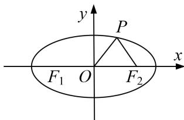
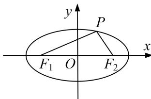

<!-- question-source:start -->
[例1] (2019·全国II)已知 $F_{1}$ ， $F_{2}$ 是椭圆 $C: \frac{x^{2}}{a^{2}} + \frac{y^{2}}{b^{2}} = 1 (a > b > 0)$ 的两个焦点， $P$ 为 $C$ 上的点， $O$ 为坐标原点.

(1)若 $\triangle POF_{2}$ 为等边三角形，求 $C$ 的离心率；

(2)如果存在点 P，使得 $PF_{1} \perp PF_{2}$ ，且 $\triangle F_{1}PF_{2}$ 的面积等于 16，求 b 的值和 a 的取值范围.

(1) 图

(2) 图

(2)由题意可知，若满足条件的点 $P(x, y)$ 存在，则 $\frac{1}{2} |y| \cdot 2c = 16$ ， $\frac{y}{x + c} \cdot \frac{y}{x - c} = -1$

即 $c|y| = 16$ ，①， $x^{2} + y^{2} = c^{2}$ ，②，又 $\frac{x^2}{a^2} +\frac{y^2}{b^2} = 1.$ ③

由②③及 $a^2 = b^2 + c^2$ 得 $y^2 = \frac{b^4}{c^2}$ . 又由①知 $y^2 = \frac{16^2}{c^2}$ , 故 $b = 4$ .

由②③及 $a^{2}=b^{2}+c^{2}$ 得 $x^{2}=\frac{a^{2}}{c^{2}}(c^{2}-b^{2})$ ，所以 $c^{2}\geq b^{2}$ ，从而 $a^{2}=b^{2}+c^{2}\geq2b^{2}=32$ ，故 $a\geq4\sqrt{2}$ .

当 $b = 4$ ， $a\geq 4\sqrt{2}$ 时，存在满足条件的点 $P$ .所以 $b = 4$ ， $a$ 的取值范围为 $[4\sqrt{2}, + \infty)$
<!-- question-source:end -->

![[高中/总复习/专题/圆锥曲线/专题23  参数及点的坐标(横或纵)型取值范围模型-圆锥曲线/专题23_参数及点的坐标_横或纵_型取值范围模型/例题选讲/例题/answers/Q00032612A1.md]]
