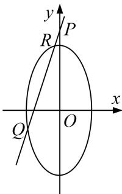

<!-- question-source:start -->
[例 3] 在平面直角坐标系 xOy 中，已知 $\triangle ABC$ 的两个顶点 A, B 的坐标分别为 $(-1, 0)$ ， $(1, 0)$ ，且 AC, BC 所在直线的斜率之积等于 -2，记顶点 C 的轨迹为曲线 E.

(1)求曲线 E 的方程;

(2)设直线 $y = kx + 2 (0 < k < 2)$ 与 $y$ 轴相交于点 $P$ ，与曲线 $E$ 相交于不同的两点 $Q$ ， $R$ （点 $R$ 在点 $P$ 和点 $Q$ 之间），且 $\overrightarrow{PQ} = \lambda \overrightarrow{PR}$ ，求实数 $\lambda$ 的取值范围.

(2)设 $R(x_{1},y_{1})$ ， $Q(x_{2},y_{2})$ .联立，得 $\left\{ \begin{array}{l}y = kx + 2,\\ x^2 +\frac{y^2}{2} = 1, \end{array} \right.$ 消去 $y$ ，可得 $(2 + k^{2})x^{2} + 4kx + 2 = 0,$

$\therefore \Delta = 8k^{2} - 16 > 0, \therefore k^{2} > 2.$ 又 $0 < k < 2, \therefore \sqrt{2} < k < 2.$

由根与系数的关系得， $x_{1}+x_{2}=-\frac{4k}{2+k^{2}}$ ，①， $x_{1}x_{2}=\frac{2}{2+k^{2}}$ ，②

$\because \overrightarrow{PQ} = \lambda \overrightarrow{PR}$ ，点 $R$ 在点 $P$ 和点 $Q$ 之间， $\therefore x_{2} = \lambda x_{1}(\lambda >1)$ ，③

联立①②③，可得 $\frac{(1 + \lambda)^2}{\lambda} = \frac{8k^2}{2 + k^2}$ . $\because \sqrt{2} < k < 2, \therefore \frac{8k^2}{2 + k^2} = \frac{8}{\frac{2}{k^2} + 1} \in (4, \frac{16}{3}), \therefore 4 < \frac{(1 + \lambda)^2}{\lambda} < \frac{16}{3},$

$\therefore\frac{1}{3}<\lambda<3,\quad 且 \lambda\neq1,\quad\because\lambda>1,\quad\therefore 实数\lambda 的取值范围为(1,3).$
<!-- question-source:end -->

![[高中/总复习/专题/圆锥曲线/专题23  参数及点的坐标(横或纵)型取值范围模型-圆锥曲线/专题23_参数及点的坐标_横或纵_型取值范围模型/例题选讲/例题/answers/Q00032614A1.md]]
