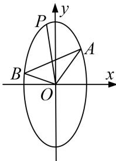

<!-- question-source:start -->
[例5] 已知离心率为 $\frac{\sqrt{3}}{2}$ 的椭圆 $C$ 焦点在 $y$ 轴上，且以椭圆的4个顶点为各顶点的四边形的面积为4，过点 $M(0,3)$ 的直线 $l$ 与椭圆 $C$ 相交于不同的两点 $A$ 、 $B$ .

(1)求椭圆 C 的方程;

(2)设 $P$ 为椭圆上一点，且 $\overrightarrow{OA} +\overrightarrow{OB} = \lambda \overrightarrow{OP}(O$ 为坐标原点). 求当 $|AB| < \sqrt{3}$ 时，实数 $\lambda$ 的取值范围.

(2)设 $A(x_{1}, y_{1})$ , $B(x_{2}, y_{2})$ , $P(x_{3}, y_{3})$ .

当直线 AB 的斜率不存在时，直线 AB 的方程为 x=0，此时 $\left|AB\right|=4>\sqrt{3}$ ，与题意不符。当直线 AB 的斜率存在时，设直线 AB 的方程为 $y=kx+3$ ，

由 $\left\{ \begin{array}{l} y = kx + 3, \\ x^2 + \frac{y^2}{4} = 1 \end{array} \right.$ 消去 $y$ 得 $(4 + k^2)x^2 + 6kx + 5 = 0$ ，所以 $\Delta = (6k)^2 - 20(4 + k^2)$ ，由 $\Delta > 0$ ，得 $k^2 > 5$

$$
x _ {1} + x _ {2} = \frac {- 6 k}{4 + k ^ {2}}, x _ {1} \cdot x _ {2} = \frac {5}{4 + k ^ {2}}, y _ {1} + y _ {2} = (k x _ {1} + 3) + (k x _ {2} + 3) = \frac {2 4}{4 + k ^ {2}},
$$

因为 $|AB|=\sqrt{(x_{1}-x_{2})^{2}+(y_{1}-y_{2})^{2}}<\sqrt{3}$ ，所以 $\sqrt{1+k^{2}}\cdot\sqrt{\left(\frac{-6k}{4+k^{2}}\right)^{2}-\frac{20}{4+k^{2}}}<\sqrt{3}$

解得 $-\frac{16}{13}<k^{2}<8$ ，所以 $5<k^{2}<8$ 。

因为 $\overrightarrow{OA} + \overrightarrow{OB} = \lambda \overrightarrow{OP}$ ，即 $(x_{1}, y_{1}) + (x_{2}, y_{2}) = \lambda (x_{3}, y_{3})$ ，所以当 $\lambda = 0$ 时，由 $\overrightarrow{OA} + \overrightarrow{OB} = 0$ ，

得 $x_{1} + x_{2} = \frac{-6k}{4 + k^{2}} = 0$ ， $y_{1} + y_{2} = \frac{24}{4 + k^{2}} = 0$ ，解得 $k\in \emptyset$ ，所以此时符合条件的直线 $l$ 不存在；

当 $\lambda \neq 0$ 时， $x_{3} = \frac{x_{1} + x_{2}}{\lambda} = \frac{-6k}{\lambda(4 + k^{2})}$ ， $y_{3} = \frac{y_{1} + y_{2}}{\lambda} = \frac{24}{\lambda(4 + k^{2})}$ ，

因为点 $P(x_{3}, y_{3})$ 在椭圆上，所以 $\left[\frac{-6k}{\lambda(4+k^{2})}\right]^{2}+\frac{1}{4}\left[\frac{24}{\lambda(4+k^{2})}\right]^{2}=1$ ，化简得 $\lambda^{2}=\frac{36}{4+k^{2}}$ ，因为 $5<k^{2}<8$ ，所以 $3<\lambda^{2}<4$ ，则 $\lambda\in(-2, -\sqrt{3})\cup(\sqrt{3}, 2)$ .

综上，实数 $\lambda$ 的取值范围为 $(-2, -\sqrt{3})\cup(\sqrt{3}, 2)$ .
<!-- question-source:end -->

![[高中/总复习/专题/圆锥曲线/专题23  参数及点的坐标(横或纵)型取值范围模型-圆锥曲线/专题23_参数及点的坐标_横或纵_型取值范围模型/例题选讲/例题/answers/Q00032616A1.md]]
