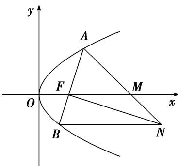

<!-- question-source:start -->
[例 6] (2016·浙江)如图，设抛物线 $y^{2}=2px(p>0)$ 的焦点为 F，抛物线上的点 A 到 y 轴的距离等于 $|AF|-1$ .

(1)求 $p$ 的值；

(2)若直线 $AF$ 交抛物线于另一点 $B$ ，过 $B$ 与 $x$ 轴平行的直线和过 $F$ 与 $AB$ 垂直的直线交于点 $N$ ， $AN$ 与 $x$ 轴交于点 $M$ 。求 $M$ 的横坐标的取值范围。

(2)由(1)得，抛物线方程为 $y^{2}=4x$ ， $F(1,0)$ ，可设 $A(t^{2},2t)$ ， $t\neq0$ ， $t\neq\pm1$ .

因为 AF 不垂直于 y 轴，可设直线 AF: $x = sy + 1 (s \neq 0)$ ，由 $\left\{\begin{aligned}x &= sy + 1 \\ y^2 &= 4x\end{aligned}\right.$ ，消去 x 得 $y^2 - 4sy - 4 = 0$ ，

故 $y_{1}y_{2}=-4$ ，所以 $B\left(\frac{1}{t^{2}}, -\frac{2}{t}\right)$ .

又直线 AB 的斜率为 $\frac{2t}{t^{2}-1}$ ，故直线 FN 的斜率为 $-\frac{t^{2}-1}{2t}$ .

从而得直线 FN: $y=-\frac{t^{2}-1}{2t}(x-1)$ ，直线 BN: $y=-\frac{2}{t}$ ，所以 $N\left(\frac{t^{2}+3}{t^{2}-1}, -\frac{2}{t}\right)$ .

设 $M(m, 0)$ ，由 A, M, N 三点共线得 $\frac{2t}{t^{2}-m}=\frac{2t+\frac{2}{t}}{t^{2}-\frac{t^{2}+3}{t^{2}-1}}$ ，于是 $m=\frac{2t^{2}}{t^{2}-1}=2+\frac{2}{t^{2}-1}$ .

所以 m<0 或 m>2．经检验，m<0 或 m>2 满足题意.

综上，点 M 的横坐标的取值范围是 $(-∞, 0) ∪ (2, +∞)$ .
<!-- question-source:end -->

![[高中/总复习/专题/圆锥曲线/专题23  参数及点的坐标(横或纵)型取值范围模型-圆锥曲线/专题23_参数及点的坐标_横或纵_型取值范围模型/例题选讲/例题/answers/Q00032617A1.md]]
