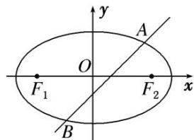

> [!faq]- 教师版例题解析
>
> > [!success]- **【答案】** 详见解析
>
> > [!note]- **【分析】**
> > 本题未单列分析。
>
> > [!note]- **【解析】**
> > [规范解答] (1) 因为直线 $l: x - my - \frac{m^2}{2} = 0$ 经过 $F_2(\sqrt{m^2 - 1}, 0)$ ，所以 $\sqrt{m^2 - 1} = \frac{m^2}{2}$ ，得 $m^2 = 2$ . 又因为 $m > 1$ ，所以 $m = \sqrt{2}$ ，故直线 $l$ 的方程为 $x - \sqrt{2}y - 1 = 0$ .
> > 
