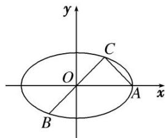

<!-- question-source:start -->
1. 已知 $A, B, C$ 是椭圆 $M: \frac{x^2}{a^2} + \frac{y^2}{b^2} = 1 (a > b > 0)$ 上的三点，其中点 $A$ 的坐标为 $(2\sqrt{3}, 0)$ ， $BC$ 过椭圆的中心，且 $\overrightarrow{AC} \cdot \overrightarrow{BC} = 0$ ， $|\overrightarrow{BC}| = 2|\overrightarrow{AC}|$ .

(1)求椭圆 M 的方程;

(2)过点 $(0, t)$ 的直线 $l$ (斜率存在时)与椭圆 $M$ 交于两点 $P, Q$ , 设 $D$ 为椭圆 $M$ 与 $y$ 轴负半轴的交点, 且 $|\overrightarrow{DP}| = |\overrightarrow{DQ}|$ , 求实数 $t$ 的取值范围.

<!-- question-source:end -->

![[高中/总复习/专题/圆锥曲线/专题23  参数及点的坐标(横或纵)型取值范围模型-圆锥曲线/专题23_参数及点的坐标_横或纵_型取值范围模型/对点训练/题目/answers/Q00032620A1.md]]
