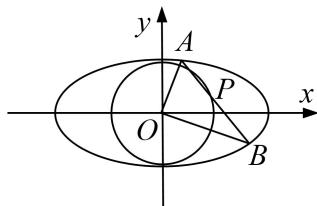

<!-- question-source:start -->
5. 设椭圆 $C: \frac{x^2}{a^2} + \frac{y^2}{b^2} = 1 (a > b > 0)$ , 定义椭圆 $C$ 的“相关圆”方程为 $x^2 + y^2 = \frac{a^2b^2}{a^2 + b^2}$ , 若抛物线 $y^2 = 4x$ 的焦点与椭圆 $C$ 的一个焦点重合, 且椭圆 $C$ 短轴的一个端点和其两个焦点构成直角三角形.

(1)求椭圆 C 的方程和“相关圆”E 的方程;

(2)过“相关圆”E 上任意一点 P 的直线 l: $y=kx+m$ 与椭圆 C 交于 A, B 两点. O 为坐标原点，若 $OA \perp OB$ ，证明：原点 O 到直线 AB 的距离是定值，并求实数 m 的取值范围.

<!-- question-source:end -->

![[高中/总复习/专题/圆锥曲线/专题23  参数及点的坐标(横或纵)型取值范围模型-圆锥曲线/专题23_参数及点的坐标_横或纵_型取值范围模型/对点训练/题目/answers/Q00032624A1.md]]
