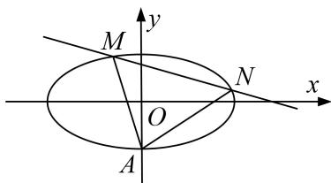

<!-- question-source:start -->
6. 已知椭圆的一个顶点为 $A(0, -1)$ , 焦点在 $x$ 轴上, 中心在原点. 若右焦点到直线 $x - y + 2\sqrt{2} = 0$ 的距离为 3.

(1)求椭圆的标准方程;

(2)设直线 $y = kx + m (k \neq 0)$ 与椭圆相交于不同的两点 $M, N$ . 当 $|AM| = |AN|$ 时，求 $m$ 的取值范围.

<!-- question-source:end -->

![[高中/总复习/专题/圆锥曲线/专题23  参数及点的坐标(横或纵)型取值范围模型-圆锥曲线/专题23_参数及点的坐标_横或纵_型取值范围模型/对点训练/题目/answers/Q00032625A1.md]]
