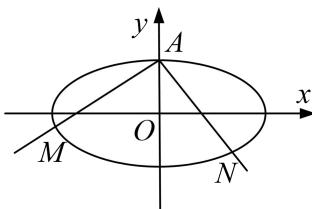

<!-- question-source:start -->
7. 过椭圆 $C: \frac{x^2}{9} + \frac{y^2}{b^2} = 1 (0 < b < 3)$ 的上顶点 $A$ 作相互垂直的两条直线，分别交椭圆于不同的两点 $M, N$ （点 $M, N$ 与点 $A$ 不重合）.

(1)设椭圆的下顶点为 $B(0, -b)$ ，当直线 $AM$ 的斜率为 $\sqrt{5}$ 时，若 $S_{\triangle ANB} = 2S_{\triangle AMB}$ ，求 $b$ 的值；

(2)若存在点 $M, N$ ，使得 $|AM| = |AN|$ ，且直线 $AM, AN$ 的斜率的绝对值都不为 1，求实数 $b$ 的取值范围.

<!-- question-source:end -->

![[高中/总复习/专题/圆锥曲线/专题23  参数及点的坐标(横或纵)型取值范围模型-圆锥曲线/专题23_参数及点的坐标_横或纵_型取值范围模型/对点训练/题目/answers/Q00032626A1.md]]
