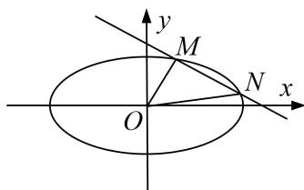

<!-- question-source:start -->
1. 已知椭圆 $C: \frac{x^2}{a^2} + \frac{y^2}{b^2} = 1 (a > b > 0)$ 的离心率为 $\frac{\sqrt{3}}{2}$ ，短轴长为 2.

(1)求椭圆 C 的标准方程;

(2)设直线 $l: y = kx + m$ 与椭圆 $C$ 交于 $M, N$ 两点， $O$ 为坐标原点，若 $k_{OM} \cdot k_{ON} = \frac{5}{4}$ ，求原点 $O$ 到直线 $l$ 的距离的取值范围.

<!-- question-source:end -->

![[高中/总复习/专题/圆锥曲线/专题24  长度和距离型取值范围模型-圆锥曲线/专题24__长度和距离型取值范围模型/对点训练/answers/Q00042590A1.md]]
