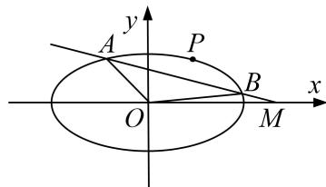

<!-- question-source:start -->
3. 已知椭圆 $C: \frac{x^2}{a^2} + \frac{y^2}{b^2} = 1 (a > b > 0)$ 的焦距为 2，且过点 $\left(1, \frac{\sqrt{2}}{2}\right)$ .

(1)求椭圆 C 的方程;

(2)过点 $M(2,0)$ 的直线交椭圆 $C$ 于 $A,B$ 两点， $P$ 为椭圆 $C$ 上一点， $O$ 为坐标原点，且满足 $\overrightarrow{OA} +\overrightarrow{OB} = t\overrightarrow{OP}$ ，其中 $t\in \left(\frac{2\sqrt{6}}{3},2\right)$ ，求 $|AB|$ 的取值范围.

<!-- question-source:end -->

![[高中/总复习/专题/圆锥曲线/专题24  长度和距离型取值范围模型-圆锥曲线/专题24__长度和距离型取值范围模型/对点训练/answers/Q00042592A1.md]]
