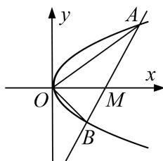

<!-- question-source:start -->
7. 已知抛物线 $E: y^{2} = 2px (p > 0)$ 与过点 $M(a, 0)(a > 0)$ 的直线 $l$ 交于 $A, B$ 两点，且总有 $OA \perp OB$ .

(1)确定 $p$ 与 $a$ 的数量关系；

(2)若 $|OM|\cdot|AB|=\lambda|AM|\cdot|MB|$ ，求 $\lambda$ 的取值范围.

<!-- question-source:end -->

![[高中/总复习/专题/圆锥曲线/专题24  长度和距离型取值范围模型-圆锥曲线/专题24__长度和距离型取值范围模型/对点训练/answers/Q00042596A1.md]]
