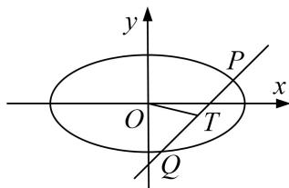

> [!faq]- 《专题24  长度和距离型取值范围模型-圆锥曲线》例题解析
>
> > [!success]- **【答案】** 详见解析
>
> > [!note]- **【分析】**
> > 本题未单列分析。
>
> > [!note]- **【解析】**
> > (1)求曲线 C 的方程;
> >
> > (2)设 $P$ ， $Q$ 是曲线 $C$ 上两动点，线段 $PQ$ 的中点为 $T$ ，直线 $OP$ ， $OQ$ 的斜率分别为 $k_{1}$ ， $k_{2}$ ，且 $k_{1}k_{2} = -\frac{1}{4}$ ，求 $\vert OT\vert$ 的取值范围.
> >
> > 
> >
> > 4. 解析
> > (1) 设动点 $M(x, y)$ ， $A(x_{0}, y_{0})$ ，∵ $AN \perp x$ 轴于点 N，∴ $N(x_{0}, 0)$ .
> >
> > 又圆 $C_{1}$ : $x^{2} + y^{2} = r^{2} (r > 0)$ 与直线 $l_{0}$ : $y = x + 2\sqrt{2}$ ，即 $x - y + 2\sqrt{2} = 0$ 相切，
> >
> > $\therefore r = \frac{|2\sqrt{2}|}{\sqrt{2}} = 2, \therefore$ 圆 $C_1: x^2 + y^2 = 4.$ 由 $\overrightarrow{OM} + \overrightarrow{AM} = \overrightarrow{ON}$ ,
> >
> > 得 $(x, y)+(x-x_{0}, y-y_{0})=(x_{0}, 0)$ ，∴ $\begin{cases}2x-x_{0}=x_{0},\\2y-y_{0}=0,\end{cases}$ 即 $\begin{cases}x_{0}=x,\\y_{0}=2y,\end{cases}$
> >
> > 又点 A 为圆 $C_{1}$ 上一动点，∴ $x^{2} + 4y^{2} = 4$ ，∴ 曲线 C 的方程为 $\frac{x^{2}}{4} + y^{2} = 1$ .
> >
> > (2)当直线 PQ 的斜率不存在时，可取直线 OP 的方程为 $y=\frac{1}{2}x$ ,
> >
> > 不妨取点 $P\left[\sqrt{2}, \frac{\sqrt{2}}{2}\right]$ ，则 $Q\left[\sqrt{2}, -\frac{\sqrt{2}}{2}\right]$ ， $T(\sqrt{2}, 0)$ ， $\therefore |OT| = \sqrt{2}$ .
> >
> > 当直线 PQ 的斜率存在时，设直线 PQ 的方程为 $y=kx+m$ ， $P(x_{1},y_{1})$ ， $Q(x_{2},y_{2})$ ，
> >
> > 由 $\left\{\begin{aligned}y&=kx+m,\\ x^{2}&+4y^{2}=4,\end{aligned}\right.$ 可得 $(1+4k^{2})x^{2}+8kmx+4m^{2}-4=0,$
> >
> > $$
> > \therefore x _ {1} + x _ {2} = \frac {- 8 k m}{1 + 4 k ^ {2}}, x _ {1} x _ {2} = \frac {4 m ^ {2} - 4}{1 + 4 k ^ {2}}. \because k _ {1} k _ {2} = - \frac {1}{4}, \therefore 4 y _ {1} y _ {2} + x _ {1} x _ {2} = 0.
> > $$
> >
> > ∴ $4(kx_{1}+m)(kx_{2}+m)+x_{1}x_{2}=(4k^{2}+1)x_{1}x_{2}+4km(x_{1}+x_{2})+4m^{2}=4m^{2}-4-\frac{32k^{2}m^{2}}{1+4k^{2}}+4m^{2}=0$ ,
> >
> > 化简得 $2m^{2}=1+4k^{2},\quad\therefore m^{2}\geq\frac{1}{2}.$
> >
> > $$
> > \Delta = 6 4 k ^ {2} m ^ {2} - 4 (4 k ^ {2} + 1) (4 m ^ {2} - 4) = 1 6 (4 k ^ {2} + 1 - m ^ {2}) = 1 6 m ^ {2} > 0,
> > $$
> >
> > 设 $T(x'_{0}, y'_{0})$ ，则 $x'_{0}=\frac{x_{1}+x_{2}}{2}=\frac{-4km}{1+4k^{2}}=\frac{-2k}{m}$ ， $y'_{0}=kx'_{0}+m=\frac{1}{2m}$ .
> >
> > $\therefore |OT|^2 = x'0 + y'0 = \frac{4k^2}{m^2} + \frac{1}{4m^2} = 2 - \frac{3}{4m^2} \in \left[\frac{1}{2}, 2\right], \therefore |OT| \in \left[\frac{\sqrt{2}}{2}, \sqrt{2}\right].$
> >
> > 综上， $|OT|$ 的取值范围为 $\left[\frac{\sqrt{2}}{2},\sqrt{2}\right]$ .
