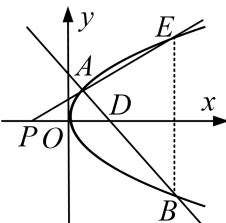

<!-- question-source:start -->
[例 1] 已知抛物线 C: $y^{2}=2px(p>0)$ 的焦点为 F, A 为 C 上位于第一象限的任意一点，过点 A 的直线 l 交 C 于另一点 B，交 x 轴的正半轴于点 D.

(1)若当点 A 的横坐标为 3，且 $\triangle ADF$ 为等边三角形，求 C 的方程；

(2)对于(1)中求出的抛物线 $C$ ，若点 $D(x_0, 0)\left[\frac{x_0 \geq 1}{2}\right]$ ，记点 $B$ 关于 $x$ 轴的对称点为 $E$ ， $AE$ 交 $x$ 轴于点 $P$ ，且 $AP \perp BP$ ，求证：点 $P$ 的坐标为 $(-x_0, 0)$ ，并求点 $P$ 到直线 $AB$ 的距离 $d$ 的取值范围.

(2)依题意可设直线 AB 的方程为 $x=my+x_{0}(m\neq0)$ ， $A(x_{1},y_{1})$ ， $B(x_{2},y_{2})$ ，

则 $E(x_{2}, - y_{2})$ ，由 $\left\{ \begin{array}{l}y^{2} = 4x,\\ x = my + x_{0}, \end{array} \right.$ 消去 $x$ ，得 $y^{2} - 4my - 4x_{0} = 0$ ， $x_0\geq \frac{1}{2}$

所以 $\Delta=16m^{2}+16x_{0}>0,\quad y_{1}+y_{2}=4m,\quad y_{1}y_{2}=-4x_{0},$

设 P 的坐标为 $(x_{P}, 0)$ ，则 $\overrightarrow{PE}=(x_{2}-x_{P}, -y_{2})$ ， $\overrightarrow{PA}=(x_{1}-x_{P}, y_{1})$

由题意知 $\overrightarrow{PE} // \overrightarrow{PA}$ ，所以 $(x_2 - x_P)y_1 + y_2(x_1 - x_P) = 0$ ，即 $x_2y_1 + y_2x_1 = \frac{y_2^2y_1 + y_1^2y_2}{4} = \frac{y_1y_2(y_1 + y_2)}{4} = (y_1 + y_2)x_P$ 显然 $y_1 + y_2 = 4m \neq 0$ ，所以 $x_P = \frac{y_1y_2}{4} = -x_0$ ，即证 $P(-x_0, 0)$ ，由题意知△EPB为等腰直角三角形，所以 $k_{AP} = 1$ ，即 $\frac{y_1 + y_2}{x_1 - x_2} = 1$ ，也即 $\frac{y_1 + y_2}{\frac{1}{4}(y_1^2 - y_2^2)} = 1$

所以 $y_{1}-y_{2}=4$ ，所以 $(y_{1}+y_{2})^{2}-4y_{1}y_{2}=16$ ，即 $16m^{2}+16x_{0}=16$ ， $m^{2}=1-x_{0}$ ， $x_{0}<1$ ，

又因为 $x_0 \geq \frac{1}{2}$ ，所以 $\frac{1}{2} \leq x_0 < 1$ ， $d = \frac{|-x_0 - x_0|}{\sqrt{1 + m^2}} = \frac{2x_0}{\sqrt{1 + m^2}} = \frac{2x_0}{\sqrt{2 - x_0}}$

令 $\sqrt{2-x_{0}}=t\in\left[1,\frac{\sqrt{6}}{2}\right]$ ， $x_{0}=2-t^{2}$ ， $d=\frac{2(2-t^{2})}{t}=\frac{4}{t}-2t$ ，易知 $f(t)=\frac{4}{t}-2t$ 在 $\left[1,\frac{\sqrt{6}}{2}\right]$ 上是减函数，
所以 $d \in \left[\frac{\sqrt{6}}{3}, 2\right]$ . 所以 d 的取值范围是 $\left[\frac{\sqrt{6}}{3}, 2\right]$ .
<!-- question-source:end -->

![[高中/总复习/专题/圆锥曲线/专题24  长度和距离型取值范围模型-圆锥曲线/专题24_长度和距离型取值范围模型/例题选讲/例题/answers/Q00032628A1.md]]
