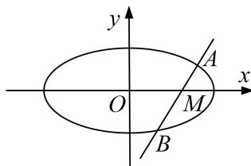

<!-- question-source:start -->
[例2] 已知椭圆 $C: \frac{x^2}{a^2} + \frac{y^2}{b^2} = 1 (a > b > 0)$ 的离心率为 $\frac{\sqrt{2}}{2}$ ，过点 $M(1, 0)$ 的直线 $l$ 交椭圆 $C$ 于 $A$ ， $B$ 两点， $|MA| = \lambda |MB|$ ，且当直线 $l$ 垂直于 $x$ 轴时， $|AB| = \sqrt{2}$ .

(1)求椭圆 C 的方程;

(2)若 $\lambda \in \left[\frac{1}{2}, 2\right]$ ，求弦长 $|AB|$ 的取值范围.

(2)当过点 M 的直线斜率为 0 时，点 A，B 分别为椭圆长轴的端点，

$\lambda = \frac{|MA|}{|MB|} = \frac{\sqrt{2} + 1}{\sqrt{2} - 1} = 3 + 2\sqrt{2} > 2$ 或 $\lambda = \frac{|MA|}{|MB|} = \frac{\sqrt{2} - 1}{\sqrt{2} + 1} = 3 - 2\sqrt{2} < \frac{1}{2}$ ，不符合题意。∴直线的斜率不能为0.

设直线方程为 $x=my+1$ ， $A(x_{1}, y_{1})$ ， $B(x_{2}, y_{2})$ ，

将直线方程代入椭圆方程得： $(m^{2}+2)y^{2}+2my-1=0$

由根与系数的关系可得， $\left\{\begin{aligned}y_{1}+y_{2}&=-\frac{2m}{m^{2}+2}\\ y_{1}y_{2}&=-\frac{1}{m^{2}+2}\end{aligned}\right.$ ①, ②,

将①式平方除以②式可得： $\frac{y_{1}}{y_{2}}+\frac{y_{2}}{y_{1}}+2=-\frac{4m^{2}}{m^{2}+2}$ ，由已知 $|MA|=\lambda|MB|$ 可知， $\frac{y_{1}}{y_{2}}=-\lambda$

$\therefore -\lambda - \frac{1}{\lambda} + 2 = -\frac{4m^2}{m^2 + 2}$ , 又知 $\lambda \in \left[\frac{1}{2}, 2\right]$ , $\therefore -\lambda - \frac{1}{\lambda} + 2 \in \left[-\frac{1}{2}, 0\right]$ , $\therefore -\frac{1}{2} \leq -\frac{4m^2}{m^2 + 2} \leq 0$ , 解得 $m^2 \in \left[0, \frac{2}{7}\right]$ .

$$
\left| A B \right| ^ {2} = (1 + m ^ {2}) \left| y _ {1} - y _ {2} \right| ^ {2} = (1 + m ^ {2}) \left[ \left(y _ {1} + y _ {2}\right) ^ {2} - 4 y _ {1} y _ {2} \right] = 8 \left(\frac {m ^ {2} + 1}{m ^ {2} + 2}\right) ^ {2} = 8 \left(1 - \frac {1}{m ^ {2} + 2}\right) ^ {2},
$$

$$
\because m ^ {2} \in \left[ 0, \frac {2}{7} \right], \therefore \frac {1}{m ^ {2} + 2} \in \left[ \frac {7}{1 6}, \frac {1}{2} \right], \therefore | A B | \in \left[ \sqrt {2}, \frac {9 \sqrt {2}}{8} \right].
$$
<!-- question-source:end -->

![[高中/总复习/专题/圆锥曲线/专题24  长度和距离型取值范围模型-圆锥曲线/专题24_长度和距离型取值范围模型/例题选讲/例题/answers/Q00032629A1.md]]
