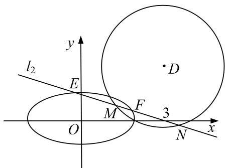

<!-- question-source:start -->
[例 4] 已知椭圆 C: $\frac{x^{2}}{a^{2}} + \frac{y^{2}}{b^{2}} = 1 (a > b > 0)$ 的离心率是 $\frac{\sqrt{3}}{2}$ ，且椭圆经过点 $(0, 1)$ .

(1)求椭圆 C 的标准方程;

(2)若直线 $l_{1}: x + 2y - 2 = 0$ 与圆 $D: x^{2} + y^{2} - 6x - 4y + m = 0$ 相切：

(i)求圆 D 的标准方程;

(ii)若直线 $l_{2}$ 过定点 $(3,0)$ ，与椭圆 $C$ 交于不同的两点 $E, F$ ，与圆 $D$ 交于不同的两点 $M, N$ ，求 $|EF| \cdot |MN|$ 的取值范围.

(2) (i) 圆 D 的标准方程为 $(x-3)^{2}+(y-2)^{2}=13-m$ ，圆心为 $(3, 2)$ ,

∵ 直线 $l_{1}$ : $x+2y-2=0$ 与圆 D 相切，∴ 圆 D 的半径 $r=\frac{|3+2\times2-2|}{\sqrt{5}}=\sqrt{5}$ ,

∴圆 D 的标准方程为 $(x-3)^{2}+(y-2)^{2}=5$ .

(ii)由题可得直线 $l_{2}$ 的斜率存在，设 $l_{2}$ 方程为 $y=k(x-3)$ ,

由 $\left\{\begin{aligned}y&=k(x+3)\\ \frac{x^{2}}{4}&+y^{2}=1\end{aligned}\right.$ 消去 y 整理得 $(1+4k^{2})x^{2}-24k^{2}x+36k^{2}-4=0$ ,

∵ 直线 $l_{2}$ 与椭圆 C 交于不同的两点 E, F,

$\therefore \Delta = (-24k^2)^2 - 4(1 + 4k^2)(36k^2 - 4) = 16(1 - 5k^2) > 0$ ，解得 $0 \leq k^2 < \frac{1}{5}$ .

设 $E(x_{1},y_{1}),F(x_{2},y_{2})$ ，则 $x_{1} + x_{2} = \frac{24k^{2}}{1 + 4k^{2}},x_{1}x_{2} = \frac{36k^{2} - 4}{1 + 4k^{2}},$

$$
\therefore | E F | = \sqrt {1 + k ^ {2}} \sqrt {(x _ {1} + x _ {2}) ^ {2} - 4 x _ {1} x _ {2}} = \sqrt {(1 + k ^ {2}) [ (\frac {2 4 k ^ {2}}{1 + 4 k ^ {2}}) ^ {2} - 4 \times \frac {3 6 k ^ {2} - 4}{1 + 4 k ^ {2}}} ] = 4 \sqrt {\frac {(1 + k ^ {2}) (1 - 5 k ^ {2})}{(1 + 4 k ^ {2}) ^ {2}}},
$$

又圆 $D$ 的圆心(3，2)到直线 $l_{2}$ ： $kx - y - 3k = 0$ 的距离 $d = \frac{|3k - 2 - 3k|}{\sqrt{k^2 + 1}} = \frac{2}{\sqrt{k^2 + 1}}$

∴圆 D 截直线 $l_{2}$ 所得弦长 $|MN|=2\sqrt{r^{2}-d^{2}}=2\sqrt{\frac{5k^{2}+1}{k^{2}+1}}$ ,

$$
\therefore | E F | \cdot | M N | = 4 \sqrt {\frac {(1 + k ^ {2}) (1 - 5 k ^ {2})}{(1 + 4 k ^ {2}) ^ {2}}} \times 2 \sqrt {\frac {5 k ^ {2} + 1}{k ^ {2} + 1}} = 8 \sqrt {\frac {1 - 2 5 k ^ {4}}{(1 + 4 k ^ {2}) ^ {2}}},
$$

设 $t = 1 + 4k^2\in \left[1,\frac{9}{5}\right]$ ，则 $k^2 = \frac{t - 1}{4},\therefore |EF|\cdot |MN| = 8\sqrt{\frac{1 - 25(\frac{t - 1}{4})^2}{t^2}} = 2\sqrt{-9(\frac{1}{t})^2 + 50\frac{1}{t} - 25},$

$\because t \in \left[1, \frac{9}{5}\right], \therefore -9\left(\frac{1}{t}\right)^2 + 50\frac{1}{t} - 25 \in (0, 16]$ ,

$\therefore |EF|\cdot|MN|$ 的取值范围为(0, 8].
<!-- question-source:end -->

![[高中/总复习/专题/圆锥曲线/专题24  长度和距离型取值范围模型-圆锥曲线/专题24_长度和距离型取值范围模型/例题选讲/例题/answers/Q00032631A1.md]]
