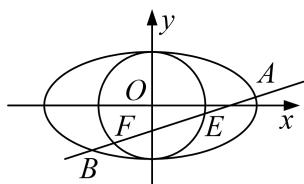

<!-- question-source:start -->
[例 5] 已知椭圆 C: $\frac{x^{2}}{a^{2}}+\frac{y^{2}}{b^{2}}=1(a>b>0)$ 的离心率为 $\frac{\sqrt{3}}{3}$ ，且椭圆 C 过点 $\left(\frac{3}{2},\frac{\sqrt{2}}{2}\right)$ .

(1)求椭圆 C 的标准方程;

(2)过椭圆 $C$ 的右焦点的直线 $l$ 与椭圆 $C$ 分别相交于 $A, B$ 两点，且与圆 $O: x^{2} + y^{2} = 2$ 相交于 $E, F$ 两点，求 $|AB| \cdot |EF|^2$ 的取值范围.

(2)由(1)可知，椭圆的右焦点为(1,0)，

①若直线 l 的斜率不存在，直线 l 的方程为 x=1，

则 $A\left(1, \frac{2\sqrt{3}}{3}\right)$ , $B\left(1, -\frac{2\sqrt{3}}{3}\right)$ , $E(1, 1)$ , $F(1, -1)$ ,

所以 $|AB|=\frac{4\sqrt{3}}{3}$ ， $|EF|^{2}=4$ ， $|AB|\cdot|EF|^{2}=\frac{16\sqrt{3}}{3}$ .

②若直线 l 的斜率存在，设直线 l 的方程为 $y=k(x-1)$ ， $A(x_{1},y_{1})$ ， $B(x_{2},y_{2})$ .

联立 $\left\{ \begin{array}{l} \frac{x^2}{3} + \frac{y^2}{2} = 1, \\ y = k - x - 1 \end{array} \right.$ 可得 $(2 + 3k^2)x^2 - 6k^2x + 3k^2 - 6 = 0$ ，则 $x_1 + x_2 = \frac{6k^2}{2 + 3k^2}$ ， $x_1x_2 = \frac{3k^2 - 6}{2 + 3k^2}$ ，

$$
| A B | = \sqrt {(1 + k ^ {2}) (x _ {1} - x _ {2}) ^ {2}} = \sqrt {(1 + k ^ {2}) \left[ \frac {\left(\frac {6 k ^ {2}}{2 + 3 k ^ {2}}\right) ^ {2}}{2} - 4 \times \frac {3 k ^ {2} - 6}{2 + 3 k ^ {2}} \right]} = \frac {4 \sqrt {3} k ^ {2} + 1}{2 + 3 k ^ {2}}.
$$

因为圆心 $O(0, 0)$ 到直线 $l$ 的距离 $d = \frac{|k|}{\sqrt{k^2 + 1}}$ ，所以 $|EF|^2 = 4\left(2 - \frac{k^2}{k^2 + 1}\right) = \frac{4}{k^2 + 1},$

$$
\left. \left| A B \right| \cdot | E F | ^ {2} = \frac {4 \sqrt {3} \left(k ^ {2} + 1\right)}{2 + 3 k ^ {2}} \cdot \frac {4 \left(k ^ {2} + 2\right)}{k ^ {2} + 1} = \frac {1 6 \sqrt {3} \left(k ^ {2} + 2\right)}{2 + 3 k ^ {2}} = \frac {1 6 \sqrt {3}}{3} \cdot \frac {k ^ {2} + 2}{k ^ {2} + \frac {2}{3}} = \frac {1 6 \sqrt {3}}{3} \left[ 1 + \frac {\frac {4}{3}}{k ^ {2} + \frac {2}{3}} \right]. \right.
$$

因为 $k^{2}\in[0,+\infty)$ ，所以 $|AB|\cdot|EF|^{2}\in\left(\frac{16\sqrt{3}}{3},16\sqrt{3}\right]$ .

综上， $|AB|\cdot|EF|^{2}$ 的取值范围为 $\left[\frac{16\sqrt{3}}{3}, 16\sqrt{3}\right]$ .
<!-- question-source:end -->

![[高中/总复习/专题/圆锥曲线/专题24  长度和距离型取值范围模型-圆锥曲线/专题24_长度和距离型取值范围模型/例题选讲/例题/answers/Q00032632A1.md]]
