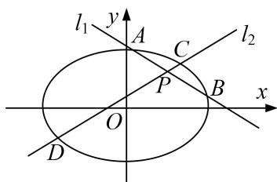

<!-- question-source:start -->
[例6] 已知椭圆 $\Gamma: \frac{x^2}{4} + \frac{y^2}{2} = 1$ ，过点 $P(1, 1)$ 作倾斜角互补的两条不同直线 $l_1, l_2$ ，设 $l_1$ 与椭圆 $\Gamma$ 交于 $A$ 、 $B$ 两点， $l_2$ 与椭圆 $\Gamma$ 交于 $C, D$ 两点.

(1)若 $P(1, 1)$ 为线段 $AB$ 的中点，求直线 $AB$ 的方程；

(2)若直线 $l_{1}$ 与 $l_{2}$ 的斜率都存在，记 $\lambda = \frac{|AB|}{|CD|}$ ，求 $\lambda$ 的取值范围.

(2)由(1)可知 $|AB|=\sqrt{1+k^{2}}\quad|x_{1}-x_{2}|=\sqrt{1+k^{2}}\cdot\sqrt{x_{1}+x_{2}\quad^{2}-4x_{1}x_{2}}=\frac{\sqrt{1+k^{2}}\cdot\sqrt{8\quad3k^{2}+2k+1}}{2k^{2}+1}$ 设直线 CD 的方程为 $y-1=-k(x-1)(k\neq0)$ . 同理可得 $|CD|=\frac{\sqrt{1+k^{2}}\cdot\sqrt{8\quad3k^{2}-2k+1}}{2k^{2}+1}$ . $\therefore\lambda=\frac{|AB|}{|CD|}=\sqrt{\frac{3k^{2}+2k+1}{3k^{2}-2k+1}}(k\neq0)$ , $\lambda>0$ . $\therefore\lambda^{2}=1+\frac{4k}{3k^{2}+1-2k}=1+\frac{4}{3k+\frac{1}{k}-2}$ , 令 $t=3k+\frac{1}{k}$ , 则 $t\in(-\infty,-2\sqrt{3}]\cup[2\sqrt{3},+\infty)$ ,

令 $g(t)=1+\frac{4}{t-2}$ , $t\in(-\infty,-2\sqrt{3}]\cup[2\sqrt{3},+\infty)$ , $\because g(t)$ 在 $(-∞,-2\sqrt{3}]$ , $[2\sqrt{3},+\infty)$ 上单调递减, $\therefore2-\sqrt{3}\leq g(t)<1$ 或 $1<g(t)\leq2+\sqrt{3}$ . $\left[\sqrt{6}-\sqrt{2}\right]$ $\left[\sqrt{6}+\sqrt{2}\right]$

故 $2 - \sqrt{3} \leq \lambda^2 < 1$ 或 $1 < \lambda^2 \leq 2 + \sqrt{3}$ . $\therefore \lambda \in \left[\frac{\sqrt{6} - \sqrt{2}}{2}, 1\right] \cup \left[1, \frac{\sqrt{6} + \sqrt{2}}{2}\right]$ .
<!-- question-source:end -->

![[高中/总复习/专题/圆锥曲线/专题24  长度和距离型取值范围模型-圆锥曲线/专题24_长度和距离型取值范围模型/例题选讲/例题/answers/Q00032633A1.md]]
