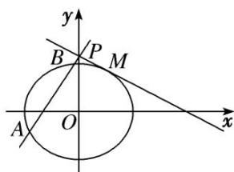

<!-- question-source:start -->
[例7] 已知点 $F$ 为椭圆 $E: \frac{x^2}{a^2} + \frac{y^2}{b^2} = 1 (a > b > 0)$ 的左焦点，且两焦点与短轴的一个顶点构成一个等边三角形，直线 $\frac{x}{4} + \frac{y}{2} = 1$ 与椭圆 $E$ 有且仅有一个交点 $M$ .

(1)求椭圆 E 的方程;

(2)设直线 $\frac{x}{4} +\frac{y}{2} = 1$ 与 $y$ 轴交于 $P$ ，过点 $P$ 的直线 $l$ 与椭圆 $E$ 交于不同的两点 $A,B$ ，若 $\lambda |PM|^2 = |PA|\cdot |PB|$ 求实数 $\lambda$ 的取值范围.

(2)由(1)得 $M\left\{1, \frac{3}{2}\right\}$ ，∵ 直线 $\frac{x}{4} + \frac{y}{2} = 1$ 与 y 轴交于 $P(0, 2)$ ，∴ $|PM|^{2} = \frac{5}{4}$ ,

①当直线 l 与 x 轴垂直时， $|PA|\cdot|PB|=(2+\sqrt{3})\times(2-\sqrt{3})=1,\quad\therefore\lambda|PM|^{2}=|PA|\cdot|PB|\Rightarrow\lambda=\frac{4}{5},$

②当直线 l 与 x 轴不垂直时，设直线 l 的方程为 $y=kx+2$ ， $A(x_{1},y_{1})$ ， $B(x_{2},y_{2})$ ，

由 $\left\{\begin{aligned}y&=kx+2,\\ 3x^{2}&+4y^{2}-12=0\end{aligned}\right.$ 消去 y，整理得 $(3+4k^{2})x^{2}+16kx+4=0$ ，

$$
x _ {1} x _ {2} = \frac {4}{3 + 4 k ^ {2}},
$$

$$
\Delta = 4 8 (4 k ^ {2} - 1) > 0
$$

$$
\therefore | P A | \cdot | P B | = (1 + k ^ {2}) x _ {1} x _ {2} = (1 + k ^ {2}) \cdot \frac {4}{3 + 4 k ^ {2}} = 1 + \frac {1}{3 + 4 k ^ {2}} = \frac {5}{4} \lambda ,
$$

$\therefore \lambda = \frac{4}{5}\left(1 + \frac{1}{3 + 4k^2}\right), \because k^2 > \frac{1}{4}, \therefore \frac{4}{5} < \lambda < 1.$ 综上所述， $\lambda$ 的取值范围是 $\left[\frac{4}{5}, 1\right]$ .
<!-- question-source:end -->

![[高中/总复习/专题/圆锥曲线/专题24  长度和距离型取值范围模型-圆锥曲线/专题24_长度和距离型取值范围模型/例题选讲/例题/answers/Q00032634A1.md]]
