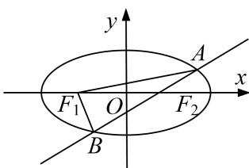

<!-- question-source:start -->
2. 已知椭圆 $C: \frac{x^2}{a^2} + \frac{y^2}{b^2} = 1 (a > b > 0)$ 经过点 $P\left(1, \frac{\sqrt{2}}{2}\right)$ ，且离心率为 $\frac{\sqrt{2}}{2}$ .

(1)求椭圆 C 的方程;

(2)设 $F_{1}$ , $F_{2}$ 分别为椭圆 $C$ 的左、右焦点, 不经过 $F_{1}$ 的直线 $l$ 与椭圆 $C$ 交于两个不同的点 $A$ , $B$ . 如果直线 $AF_{1}$ , $l$ , $BF_{1}$ 的斜率依次成等差数列, 求焦点 $F_{2}$ 到直线 $l$ 的距离 $d$ 的取值范围.

<!-- question-source:end -->

![[高中/总复习/专题/圆锥曲线/专题24  长度和距离型取值范围模型-圆锥曲线/专题24_长度和距离型取值范围模型/对点训练/题目/answers/Q00032636A1.md]]
