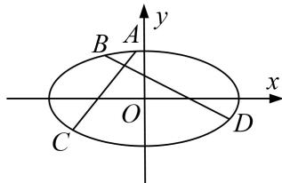

<!-- question-source:start -->
5. 已知椭圆 $\frac{x^2}{a^2} + \frac{y^2}{b^2} = 1 (a > b > 0)$ 的左、右焦点分别是 $F_1, F_2$ ，其离心率 $e = \frac{1}{2}$ ，点 $P$ 为椭圆上的一个动点， $\triangle PF_1F_2$

面积的最大值为 $4\sqrt{3}$ .

(1)求椭圆的方程;

(2)若 $A, B, C, D$ 是椭圆上不重合的四个点， $AC$ 与 $BD$ 相交于点 $F_{1}$ ， $\overrightarrow{AC} \cdot \overrightarrow{BD} = 0$ ，求 $|\overrightarrow{AC}| + |\overrightarrow{BD}|$ 的取值范围.

<!-- question-source:end -->

![[高中/总复习/专题/圆锥曲线/专题24  长度和距离型取值范围模型-圆锥曲线/专题24_长度和距离型取值范围模型/对点训练/题目/answers/Q00032639A1.md]]
