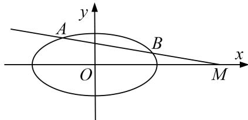

<!-- question-source:start -->
6. 已知椭圆 $C: \frac{x^2}{a^2} + \frac{y^2}{b^2} = 1 (a > b > 0)$ 的离心率 $e = \frac{\sqrt{3}}{2}$ ，直线 $x + \sqrt{3} y - 1 = 0$ 被以椭圆 $C$ 的短轴为直径的圆截得的弦长为 $\sqrt{3}$ .

(1)求椭圆 C 的方程;

(2)过点 $M(4, 0)$ 的直线 l 交椭圆于 A，B 两个不同的点，且 $\lambda = |MA| \cdot |MB|$ ，求 $\lambda$ 的取值范围.

<!-- question-source:end -->

![[高中/总复习/专题/圆锥曲线/专题24  长度和距离型取值范围模型-圆锥曲线/专题24_长度和距离型取值范围模型/对点训练/题目/answers/Q00032640A1.md]]
