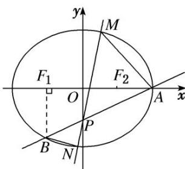

<!-- question-source:start -->
[例 4] 如图，椭圆 $C: \frac{x^{2}}{a^{2}} + \frac{y^{2}}{b^{2}} = 1 (a > b > 0)$ 的右顶点为 $A(2, 0)$ ，左、右焦点分别为 $F_{1}, F_{2}$ ，过点 A 且斜率为 $\frac{1}{2}$ 的直线与 y 轴交于点 P，与椭圆交于另一个点 B，且点 B 在 x 轴上的射影恰好为点 $F_{1}$ .

(1)求椭圆 C 的标准方程;

(2)过点 $P$ 且斜率大于 $\frac{1}{2}$ 的直线与椭圆交于 $M$ , $N$ 两点 $(|PM| > |PN|)$ , 若 $S_{\triangle PAM}: S_{\triangle PBN} = \lambda$ , 求实数 $\lambda$ 的取值范围.

[规范解答]
<!-- question-source:end -->

![[高中/总复习/专题/圆锥曲线/专题25  面积与数量积型取值范围模型-圆锥曲线/专题25__面积与数量积型取值范围模型/例题/answers/Q00042600A1.md]]
