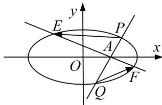

<!-- question-source:start -->
[例6] 已知圆心为 $H$ 的圆 $x^{2} + y^{2} + 2x - 15 = 0$ 和定点 $A(1,0)$ ， $B$ 是圆上任意一点，线段 $AB$ 的中垂线 $l$ 和直线 $BH$ 相交于点 $M$ ，当点 $B$ 在圆上运动时，点 $M$ 的轨迹记为曲线 $C$ .

(1)求 $C$ 的方程;

(2)过点 $A$ 作两条相互垂直的直线分别与曲线 $C$ 相交于 $P, Q$ 和 $E, F$ , 求 $\overrightarrow{PE} \cdot \overrightarrow{QF}$ 的取值范围.

[规范解答]
<!-- question-source:end -->

![[高中/总复习/专题/圆锥曲线/专题25  面积与数量积型取值范围模型-圆锥曲线/专题25__面积与数量积型取值范围模型/例题/answers/Q00042602A1.md]]
