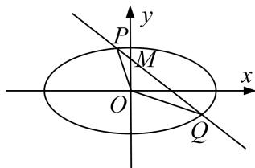

<!-- question-source:start -->
[例 8] 已知椭圆 C: $\frac{x^{2}}{a^{2}}+\frac{y^{2}}{b^{2}}=1(a>b>0)$ 的左、右顶点分别为 A, B，且长轴长为 8, T 为椭圆上任意一点，直线 TA, TB 的斜率之积为 $-\frac{3}{4}$ .

(1)求椭圆 C 的方程;

(2)设 $O$ 为坐标原点，过点 $M(0,2)$ 的动直线与椭圆 $C$ 交于 $P$ ， $Q$ 两点，求 $\overrightarrow{OP} \cdot \overrightarrow{OQ} + \overrightarrow{MP} \cdot \overrightarrow{MQ}$ 的取值范围.

[规范解答]
(1) 设 $T(x, y)$ ，由题意知 $A(-4, 0)$ ， $B(4, 0)$ ，

设直线 TA 的斜率为 $k_{1}$ ，直线 TB 的斜率为 $k_{2}$ ，则 $k_{1}=\frac{y}{x+4}$ ， $k_{2}=\frac{y}{x-4}$ ，

由 $k_{1}k_{2}=-\frac{3}{4}$ ，得 $\frac{y}{x+4}\cdot\frac{y}{x-4}=-\frac{3}{4}$ ，整理得 $\frac{x^{2}}{16}+\frac{y^{2}}{12}=1$ .

故椭圆 C 的方程为 $\frac{x^{2}}{16} + \frac{y^{2}}{12} = 1$ .

(2)当直线 PQ 的斜率存在时，设直线 PQ 的方程为 $y=kx+2$ ，点 P，Q 的坐标分别为 $(x_{1}, y_{1})$ ， $(x_{2}, y_{2})$ ，联立方程 $\left\{\begin{aligned}\frac{x^{2}}{16}+\frac{y^{2}}{12}&=1,\\ y=kx+2\end{aligned}\right.$ 消去 y，得 $(4k^{2}+3)x^{2}+16kx-32=0$ .

所以 $x_{1}+x_{2}=-\frac{16k}{4k^{2}+3}$ ， $x_{1}x_{2}=-\frac{32}{4k^{2}+3}$ .

从而， $\overrightarrow{OP}\cdot\overrightarrow{OQ}+\overrightarrow{MP}\cdot\overrightarrow{MQ}=x_{1}x_{2}+y_{1}y_{2}+[x_{1}x_{2}+(y_{1}-2)(y_{2}-2)]=2(1+k^{2})x_{1}x_{2}+2k(x_{1}+x_{2})+4=\frac{-80k^{2}-52}{4k^{2}+3}=-20+\frac{8}{4k^{2}+3}$ ，所以 $-20<\overrightarrow{OP}\cdot\overrightarrow{OQ}+\overrightarrow{MP}\cdot\overrightarrow{MQ}\leq-\frac{52}{3}$ .

当直线 PQ 的斜率不存在时， $\overrightarrow{OP}\cdot\overrightarrow{OQ}+\overrightarrow{MP}\cdot\overrightarrow{MQ}$ 的值为 -20.

综上， $\overrightarrow{OP}\cdot\overrightarrow{OQ}+\overrightarrow{MP}\cdot\overrightarrow{MQ}$ 的取值范围为 $\left[-20,\quad-\frac{52}{3}\right]$ .

【对点训练】
<!-- question-source:end -->
