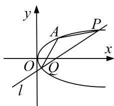

<!-- question-source:start -->
1. 已知抛物线 $C: y^{2} = 2px (p > 0)$ ，点 $F$ 为抛物线 $C$ 的焦点，点 $A(1, m) (m > 0)$ 在抛物线 $C$ 上，且 $|FA| = 2$ 过点 $F$ 作斜率为 $k\left(\frac{1}{2} \leq k \leq 2\right)$ 的直线 $l$ 与抛物线 $C$ 交于 $P$ ， $Q$ 两点.

(1)求抛物线 C 的方程;

(2)求 $\triangle APQ$ 面积的取值范围.

<!-- question-source:end -->

![[高中/总复习/专题/圆锥曲线/专题25  面积与数量积型取值范围模型-圆锥曲线/专题25__面积与数量积型取值范围模型/对点训练/answers/Q00042605A1.md]]
