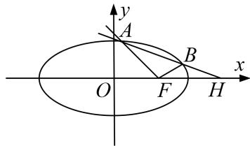

<!-- question-source:start -->
3. 已知 $M(-1, 0)$ , $F(1, 0)$ , $|\overrightarrow{MR}| = 2\sqrt{2}$ , $\overrightarrow{FR} = 2\overrightarrow{FQ}$ , $\overrightarrow{MP} = \lambda \overrightarrow{MR} (\lambda \in \mathbf{R})$ , 且 $\overrightarrow{PQ} \cdot \overrightarrow{FR} = 0$ .

(1)当 R 在该坐标平面上运动时，求点 P 运动的轨迹 C 的方程；

(2)经过点 $H(2,0)$ 作不过 $F$ 点且斜率存在的直线 $l$ ，若直线 $l$ 与轨迹 $C$ 相交于 $A$ ， $B$ 两点.

①探究：直线 FA，FB 的斜率之和是否为定值？若是，求出该定值；若不是，请说明理由；

②求 $\triangle FAB$ 面积的取值范围.

<!-- question-source:end -->

![[高中/总复习/专题/圆锥曲线/专题25  面积与数量积型取值范围模型-圆锥曲线/专题25__面积与数量积型取值范围模型/对点训练/answers/Q00042607A1.md]]
