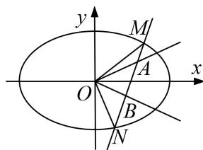

<!-- question-source:start -->
7. 已知椭圆 $C: \frac{x^2}{a^2} + \frac{y^2}{b^2} = 1 (a > b > 0)$ 的离心率为 $\frac{\sqrt{2}}{2}$ ，短轴长为 2。直线 $l: y = kx + m$ 与椭圆 $C$ 交于 $M, N$ 两点，又 $l$ 与直线 $y = \frac{1}{2} x, y = -\frac{1}{2} x$ 分别交于 $A, B$ 两点，其中点 $A$ 在第一象限，点 $B$ 在第二象限，且 $\triangle OAB$ 的面积为 2 ( $O$ 为坐标原点).

(1)求椭圆 C 的方程;

(2)求 $\overrightarrow{OM}\cdot\overrightarrow{ON}$ 的取值范围.

<!-- question-source:end -->

![[高中/总复习/专题/圆锥曲线/专题25  面积与数量积型取值范围模型-圆锥曲线/专题25__面积与数量积型取值范围模型/对点训练/answers/Q00042611A1.md]]
