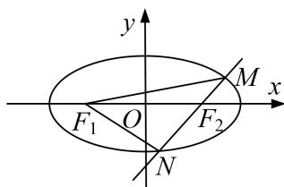

<!-- question-source:start -->
8. 已知椭圆 $C: \frac{x^2}{a^2} + \frac{y^2}{b^2} = 1 (a > b > 0)$ 的离心率为 $\frac{\sqrt{2}}{2}$ ，且以原点为圆心，椭圆的焦距为直径的圆与直线 $x\sin \theta + y\cos \theta - 1 = 0$ 相切 ( $\theta$ 为常数).

(1)求椭圆 C 的标准方程;

(2)若椭圆 C 的左、右焦点分别为 $F_{1}$ ， $F_{2}$ ，过 $F_{2}$ 作直线 l 与椭圆交于 M，N 两点，求 $\overrightarrow{F_{1}M} \cdot \overrightarrow{F_{1}N}$ 的取值范围.

<!-- question-source:end -->

![[高中/总复习/专题/圆锥曲线/专题25  面积与数量积型取值范围模型-圆锥曲线/专题25__面积与数量积型取值范围模型/对点训练/answers/Q00042612A1.md]]
