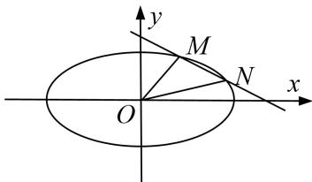

<!-- question-source:start -->
[例1] 已知椭圆 $C: \frac{x^2}{a^2} + \frac{y^2}{b^2} = 1 (a > b > 0)$ 与双曲线 $\frac{x^2}{3} - y^2 = 1$ 的离心率互为倒数，且直线 $x - y - 2 = 0$ 经过椭圆的右顶点.

(1)求椭圆 C 的标准方程;

(2)设不过原点 $O$ 的直线与椭圆 $C$ 交于 $M, N$ 两点，且直线 $OM, MN, ON$ 的斜率依次成等比数列，求 $\triangle OMN$ 面积的取值范围.

(2)由题意可设直线的方程为 $y=kx+m(k\neq0,\ m\neq0)$ ， $M(x_{1},y_{1})$ ， $N(x_{2},y_{2})$ .

联立 $\left\{ \begin{array}{l} y = kx + m, \\ \frac{x^2}{4} + y^2 = 1, \end{array} \right.$ 消去 $y$ ，并整理得 $(1 + 4k^2)x^2 + 8kmx + 4(m^2 - 1) = 0$

则 $x_{1} + x_{2} = -\frac{8km}{1 + 4k^{2}}$ ， $x_{1}x_{2} = \frac{4m^{2} - 1}{1 + 4k^{2}}$ ，于是 $y_{1}y_{2} = (kx_{1} + m)(kx_{2} + m) = k^{2}x_{1}x_{2} + km(x_{1} + x_{2}) + m^{2}$

又直线 $OM$ ，MN，ON的斜率依次成等比数列，故 $\frac{y_1y_2}{x_1x_2} = \frac{k^2x_1x_2 + km(x_1 + x_2 + m^2}{x_1x_2} = k^2,$

则 $-\frac{8k^{2}m^{2}}{1+4k^{2}}+m^{2}=0$ ，由 $m\neq0$ 得 $k^{2}=\frac{1}{4}$ ，解得 $k=\pm\frac{1}{2}$ .

又由 $\Delta=64k^{2}m^{2}-16(1+4k^{2})(m^{2}-1)=16(4k^{2}-m^{2}+1)>0$ ，得 $0<m^{2}<2$ ，

显然 $m^{2} \neq 1$ (否则 $x_{1}x_{2} = 0$ , $x_{1}$ , $x_{2}$ 中至少有一个为 0，直线 OM, ON 中至少有一个斜率不存在，与已知矛盾).

设原点 O 到直线的距离为 d，则

$$
S _ {\triangle O M N} = \frac {1}{2} | M N | d = \frac {1}{2} \cdot \sqrt {1 + k ^ {2}} \cdot | x _ {1} - x _ {2} | \cdot \frac {| m |}{\sqrt {1 + k ^ {2}}} = \frac {1}{2} | m | \sqrt {x _ {1} + x _ {2} ^ {2} - 4 x _ {1} x _ {2}} = \sqrt {- m ^ {2} - 1 ^ {2} + 1}.
$$

故由 m 的取值范围可得 $\triangle OMN$ 面积的取值范围为 $(0, 1)$ .
<!-- question-source:end -->

![[高中/总复习/专题/圆锥曲线/专题25  面积与数量积型取值范围模型-圆锥曲线/专题25_面积与数量积型取值范围模型/例题选讲/例题/answers/Q00032642A1.md]]
