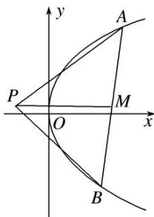

<!-- question-source:start -->
[例 2] (2018·浙江)如图，已知点 P 是 y 轴左侧(不含 y 轴)一点，抛物线 C: $y^{2}=4x$ 上存在不同的两点 A, B 满足 PA, PB 的中点均在 C 上.

(1)设 AB 中点为 M，证明：PM 垂直于 y 轴；

(2)若 $P$ 是半椭圆 $x^{2} + \frac{y^{2}}{4} = 1(x < 0)$ 上的动点，求 $\triangle PAB$ 面积的取值范围.

(2)由(1)可知 $\left\{ \begin{array}{l} y_{1} + y_{2} = 2y_{0}, \\ y_{1}y_{2} = 8x_{0} - y_{0}^{2}, \end{array} \right.$ 所以 $|PM| = \frac{1}{8}(y_{1}^{2} + y_{2}^{2}) - x_{0} = \frac{3}{4} y_{0}^{2} - 3x_{0}, |y_{1} - y_{2}| = 2\sqrt{2(y_{0}^{2} - 4x_{0})}$ .

所以 $\triangle PAB$ 的面积 $S_{\triangle PAB} = \frac{1}{2}|PM|\cdot |y_1 - y_2| = \frac{3\sqrt{2}}{4}(y_0^2 -4x_0)\frac{3}{2},$

因为 $x_0^2 +\frac{y_0^2}{4} = 1(-1\leq x_0 <   0)$ ，所以 $y_{0}^{2} - 4x_{0} = -4x_{0}^{2} - 4x_{0} + 4\in [4,5],$

所以 $\triangle PAB$ 面积的取值范围是 $\left[6\sqrt{2}, \frac{15\sqrt{10}}{4}\right]$ .
<!-- question-source:end -->

![[高中/总复习/专题/圆锥曲线/专题25  面积与数量积型取值范围模型-圆锥曲线/专题25_面积与数量积型取值范围模型/例题选讲/例题/answers/Q00032643A1.md]]
