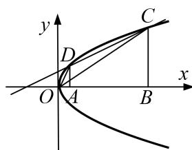

<!-- question-source:start -->
[例3] 已知 $A, B$ 是 $x$ 轴正半轴上两点 $(A$ 在 $B$ 的左侧), 且 $|AB| = a(a > 0)$ , 过 $A, B$ 分别作 $x$ 轴的垂线, 与抛物线 $y^{2} = 2px(p > 0)$ 在第一象限分别交于 $D, C$ 两点.

(1)若 a=p，点 A 与抛物线 $y^{2}=2px$ 的焦点重合，求直线 CD 的斜率；

(2)若 O 为坐标原点，记 $\triangle OCD$ 的面积为 $S_{1}$ ，梯形 ABCD 的面积为 $S_{2}$ ，求 $\frac{S_{1}}{S_{2}}$ 的取值范围.

(2)设直线 CD 的方程为 $y=kx+b(k\neq0)$ ， $C(x_{1},y_{1})$ ， $D(x_{2},y_{2})$ ，

由 $\left\{\begin{aligned}y&=kx+b,\\ y^{2}&=2px,\end{aligned}\right.$ 得 $ky^{2}-2py+2pb=0$ ，所以 $\Delta=4p^{2}-8pkb>0$ ，得 $kb<\frac{p}{2}$

又 $y_{1} + y_{2} = \frac{2p}{k}, y_{1}y_{2} = \frac{2pb}{k}$ ，由 $y_{1} + y_{2} = \frac{2p}{k} > 0, y_{1}y_{2} = \frac{2pb}{k} > 0$ ，

可知 k>0, b>0，因为 $\left|CD\right|=\sqrt{1+k^{2}}\left|x_{1}-x_{2}\right|=a\sqrt{1+k^{2}}$ ,

点 $O$ 到直线 $CD$ 的距离 $d = \frac{|b|}{\sqrt{1 + k^2}}$

所以 $S_{1} = \frac{1}{2}\cdot a\sqrt{1 + k^{2}}\cdot \frac{|b|}{\sqrt{1 + k^{2}}} = \frac{1}{2} ab$ 又 $S_{2} = \frac{1}{2} (y_{1} + y_{2})\cdot |x_{1} - x_{2}| = \frac{1}{2}\cdot \frac{2p}{k}\cdot a = \frac{ap}{k},$

所以 $\frac{S_{1}}{S_{2}}=\frac{kb}{2p}$ ，因为0<kb<p/2，所以 $0<\frac{S_{1}}{S_{2}}<\frac{1}{4}$ 。即 $\frac{S_{1}}{S_{2}}$ 的取值范围为 $\left(0,\frac{1}{4}\right)$ 。
<!-- question-source:end -->

![[高中/总复习/专题/圆锥曲线/专题25  面积与数量积型取值范围模型-圆锥曲线/专题25_面积与数量积型取值范围模型/例题选讲/例题/answers/Q00032644A1.md]]
