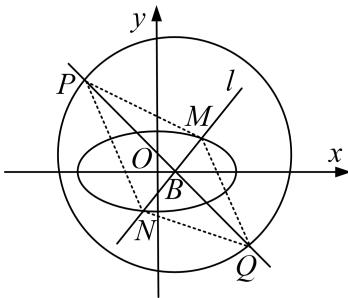

<!-- question-source:start -->
[例 5] (2016·全国乙) 设圆 $x^{2} + y^{2} + 2x - 15 = 0$ 的圆心为 A，直线 l 过点 $B(1, 0)$ 且与 x 轴不重合，l 交圆 A 于 C，D 两点，过 B 作 AC 的平行线交 AD 于点 E.

(1)证明 $|EA|+|EB|$ 为定值，并写出点E的轨迹方程；

(2)设点 $E$ 的轨迹为曲线 $C_1$ ，直线 $l$ 交 $C_1$ 于 $M$ ， $N$ 两点，过 $B$ 且与 $l$ 垂直的直线与圆 $A$ 交于 $P$ ， $Q$ 两点，求四边形MPNQ面积的取值范围.

(2)当 l 与 x 轴不垂直时，设 l 的方程为 $y=k(x-1)(k\neq0)$ ， $M(x_{1},y_{1})$ ， $N(x_{2},y_{2})$ .

由 $\left\{ \begin{array}{l} y = k(x - 1), \\ \frac{x^2}{4} + \frac{y^2}{3} = 1 \end{array} \right.$ 得 $(4k^2 + 3)x^2 - 8k^2x + 4k^2 - 12 = 0$ ，则 $x_1 + x_2 = \frac{8k^2}{4k^2 + 3}, x_1x_2 = \frac{4k^2 - 12}{4k^2 + 3}$ ，

所以 $|MN|=\sqrt{1+k^{2}}|x_{1}-x_{2}|=\frac{12(k^{2}+1)}{4k^{2}+3}.$

过点 $B(1,0)$ 且与 $l$ 垂直的直线 $m: y = -\frac{1}{k} (x - 1)$ , $A$ 到 $m$ 的距离为 $\frac{2}{\sqrt{k^2 + 1}}$ ,

所以 $|PQ|=2\sqrt{4^{2}-\left(\frac{2}{\sqrt{k^{2}+1}}\right)^{2}}=4\sqrt{\frac{4k^{2}+3}{k^{2}+1}}.$

故四边形 MPNQ 的面积 $S=\frac{1}{2}|MN||PQ|=12\sqrt{1+\frac{1}{4k^{2}+3}}$ .

可得当 l 与 x 轴不垂直时，四边形 MPNQ 面积的取值范围为 $(12, 8\sqrt{3})$ .

当 l 与 x 轴垂直时，其方程为 x=1， $|MN|=3$ ， $|PQ|=8$ ，四边形 MPNQ 的面积为 12.

综上，四边形 MPNQ 面积的取值范围为 $[12, 8\sqrt{3})$ .
<!-- question-source:end -->

![[高中/总复习/专题/圆锥曲线/专题25  面积与数量积型取值范围模型-圆锥曲线/专题25_面积与数量积型取值范围模型/例题选讲/例题/answers/Q00032646A1.md]]
