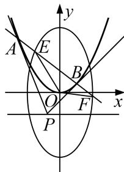

<!-- question-source:start -->
[例7] 已知椭圆 $C_1: \frac{y^2}{a^2} + \frac{x^2}{b^2} = 1 (a > b > 0)$ 与抛物线 $C_2: x^2 = 2py (p > 0)$ 有一个公共焦点，抛物线 $C_2$ 的准线 $l$ 与椭圆 $C_1$ 有一交点坐标是 $(\sqrt{2}, -2)$ .

(1)求椭圆 $C_{1}$ 与抛物线 $C_{2}$ 的方程;

(2)若点 $P$ 是直线 $l$ 上的动点，过点 $P$ 作抛物线的两条切线，切点分别为 $A, B$ ，直线 $AB$ 与椭圆 $C_1$ 分别交于点 $E, F$ ，求 $\overrightarrow{OE} \cdot \overrightarrow{OF}$ 的取值范围.

(2)设点 $P(t, -2)$ ， $A(x_{1}, y_{1})$ ， $B(x_{2}, y_{2})$ ， $E(x_{3}, y_{3})$ ， $F(x_{4}, y_{4})$ ，

抛物线方程可化为 $y=\frac{1}{8}x^{2}$ ，求导得 $y'=\frac{1}{4}x$ ，所以 AP 的方程为 $y-y_{1}=\frac{1}{4}x_{1}(x-x_{1})$ ,

将 $P(t, -2)$ 代入，得 $-2 - y_{1} = \frac{1}{4} x_{1}t - 2y_{1}$ ，即 $y_{1} = \frac{1}{4} tx_{1} + 2$ .

同理，BP 的方程为 $y_{2}=\frac{1}{4}tx_{2}+2$ ，所以直线 AB 的方程为 $y=\frac{1}{4}tx+2$ .

由 $\left\{\begin{aligned}y&=\frac{1}{4}tx+2,\\ \frac{y^{2}}{8}&+\frac{x^{2}}{4}=1\end{aligned}\right.$ 消去 y，整理得 $(t^{2}+32)x^{2}+16tx-64=0$ ,

则 $\Delta=256t^{2}+256(t^{2}+32)>0$ ，且 $x_{3}+x_{4}=\frac{-16t}{t^{2}+32}$ ， $x_{3}x_{4}=\frac{-64}{t^{2}+32}$ .

所以 $\overrightarrow{OE} \cdot \overrightarrow{OF} = x_3x_4 + y_3y_4 = (1 + \frac{t^2}{16})x_3x_4 + \frac{t}{2}(x_3 + x_4) + 4 = \frac{-8t^2 + 64}{t^2 + 32} = \frac{320}{t^2 + 32} - 8.$

因为 $0 < \frac{320}{t^2 + 32} \leq 10$ ，所以 $\overrightarrow{OE} \cdot \overrightarrow{OF}$ 的取值范围是 $(-8, 2]$ .
<!-- question-source:end -->

![[高中/总复习/专题/圆锥曲线/专题25  面积与数量积型取值范围模型-圆锥曲线/专题25_面积与数量积型取值范围模型/例题选讲/例题/answers/Q00032648A1.md]]
