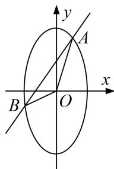

<!-- question-source:start -->
2. 已知中心在原点，焦点在 $y$ 轴上的椭圆 $C$ ，其上一点 $P$ 到两个焦点 $F_{1}$ ， $F_{2}$ 的距离之和为 4，离心率为 $\frac{\sqrt{3}}{2}$ .

(1)求椭圆 $C$ 的方程;

(2)若直线 $y=kx+1$ 与曲线 C 交于 A, B 两点，求 $\triangle OAB$ 面积的取值范围.

<!-- question-source:end -->

![[高中/总复习/专题/圆锥曲线/专题25  面积与数量积型取值范围模型-圆锥曲线/专题25_面积与数量积型取值范围模型/对点训练/题目/answers/Q00032651A1.md]]
