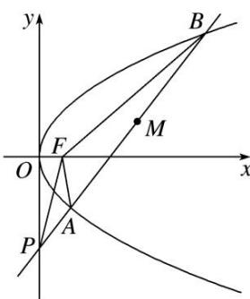

<!-- question-source:start -->
4. 已知抛物线 $C: y^{2} = 4x$ 的焦点为 $F$ , 直线 $l: y = kx - 4 (1 < k < 2)$ 与 $y$ 轴、抛物线 $C$ 相交于点 $P, A, B$ (自下而上), 记 $\triangle PAF, \triangle PBF$ 的面积分别为 $S_{1}, S_{2}$ .

(1)求 $AB$ 中点 $M$ 到 $y$ 轴的距离 $d$ 的取值范围；

(2)求 $\frac{S_{1}}{S_{2}}$ 的取值范围.

<!-- question-source:end -->

![[高中/总复习/专题/圆锥曲线/专题25  面积与数量积型取值范围模型-圆锥曲线/专题25_面积与数量积型取值范围模型/对点训练/题目/answers/Q00032653A1.md]]
