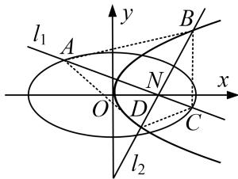

<!-- question-source:start -->
5. 在平面直角坐标系 $xOy$ 中，圆 $x^{2} + y^{2} + 2x - 15 = 0$ 的圆心为 $M$ 。已知点 $N(1,0)$ ，且 $T$ 为圆 $M$ 上的动点，线段 $TN$ 的垂直平分线交 $TM$ 于点 $P$ 。

(1)求点 P 的轨迹方程;

(2)设点 P 的轨迹为曲线 $C_{1}$ ，抛物线 $C_{2}$ ： $y^{2}=2px$ 的焦点为 N． $l_{1}$ ， $l_{2}$ 是过点 N 互相垂直的两条直线，直线 $l_{1}$ 与曲线 $C_{1}$ 交于 A，C 两点，直线 $l_{2}$ 与曲线 $C_{2}$ 交于 B，D 两点，求四边形 ABCD 面积的取值范围.

<!-- question-source:end -->

![[高中/总复习/专题/圆锥曲线/专题25  面积与数量积型取值范围模型-圆锥曲线/专题25_面积与数量积型取值范围模型/对点训练/题目/answers/Q00032654A1.md]]
