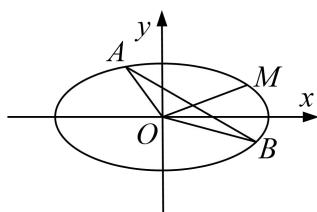

<!-- question-source:start -->
6. 已知点 $M\left(\frac{2\sqrt{3}}{3}, \frac{\sqrt{3}}{3}\right)$ 在椭圆 $C: \frac{x^2}{a^2} + \frac{y^2}{b^2} = 1 (a > b > 0)$ 上，且点 $M$ 到椭圆 $C$ 的左、右焦点的距离之和为 $2\sqrt{2}$ .

(1)求椭圆 C 的方程;

(2)设 O 为坐标原点，若椭圆 C 的弦 AB 的中点在线段 OM(不含端点 O, M)上，求 $\overrightarrow{OA} \cdot \overrightarrow{OB}$ 的取值范围.

<!-- question-source:end -->

![[高中/总复习/专题/圆锥曲线/专题25  面积与数量积型取值范围模型-圆锥曲线/专题25_面积与数量积型取值范围模型/对点训练/题目/answers/Q00032655A1.md]]
